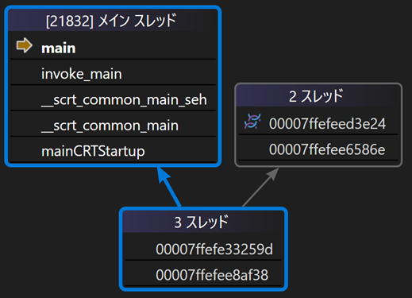

# C++

## C++ とは & 使用用途

- プログラミング言語

- コンパイル言語であり、生成された実行ファイルが CPU 上で直接動作するため高速

- C 言語の超拡張言語。3 年ごとにバージョンアップが行われ、次は C++26

- 身近なとこで使われてる。身近過ぎて使われていることすら気づかない

使用例

- Windows, 家電, Web サーバー …

- Chromium <https://github.com/chromium/chromium>

- コンパイラの素 (LLVM) <https://github.com/llvm/llvm-project>

## 超入門編

### main 関数について

C++のプログラムの開始地点、エントリーポイント

```cpp
int main()
{
    return 0;
}
```

main 関数の戻り値は実行環境側が受け取る。

{width=500px}

!!! note "豆知識"

    実はプログラムの起点は main 関数ではありません。

    実行環境を意識せず書けるように、mainから始まると決められているだけなのです！

    ↓ mainまでの呼び出し履歴　環境：MSVC(Visual Studio)

    {width=400px}

### 変数

値を保持しておく機能。メモリ上に保存されます。

```cpp
int value = 100;
```

!!! note "グローバル変数とローカル変数の違い"

    ```cpp
    int global;  // global == 0

    int main()
    {
        int local;  // local == 未定義
    }
    ```

    グローバル変数：0 に初期化される

    ローカル変数：初期化されない(ゴミの値が入ってる) → ローカル変数は必ず初期化！！！

### 型

変数の仕様を決めるもの。

```cpp
int main()
{
    int   i = 3;     // 整数
    float f = 2.1;   // 浮動小数
    bool  b = true;  // 真偽値
    char  c = 'a';   // 文字
}
```

!!! note "auto 型"

    初期化値を見て、コンパイル時に型を推論してくれる機能。

    ```cpp
    auto i = 3;     // i: int
    auto f = 2.1;   // f: double
    auto b = true;  // b: bool
    auto c = 'a';   // c: char
    ```

!!! note "uintx_t, intx_t 型"

    `int` 型や `long` 型などの型は実行環境によってサイズが変わります。サイズが変わると扱える値の範囲も変わりバグの素なので、常にサイズが一定な型が提供されています。

    | ビット数 | 符号無し整数 | 符号付き整数 |
    | :------: | :----------: | :--------: |
    |    8     |   uint8_t    |   int8_t   |
    |    16    |   uint16_t   |  int16_t   |
    |    32    |   uint32_t   |  int32_t   |
    |    64    |   uint64_t   |  int64_t   |

### 配列

```cpp
int array[5] = { 1, 2, 3, 4, 5 };
```

- 変数の集まり

- 🌟 同じ型の値のみ サイズ固定

- 🌟{} (集成体初期化)によってゼロクリアできる

!!! failure "よくあるゼロクリアのアンチパターン"

    memset を用いたゼロクリア(非効率)

    クラスでこれをすると問題になる

    ```cpp
    int array[5];
    memset(array, 0, sizeof array);
    ```

    C言語風 (ダメではない)

    ```cpp
    int array[5] = { 0 };
    ```

### 配列の要素へのアクセス

先頭の要素を読む

```cpp
int head = array[0];
```

末尾の要素に書き込む

※0 番目から始まるので、末尾は(要素数-1)番目となることに注意

```cpp
array[4] = 1234;
```

### 標準出力

```cpp
#include <iostream>

int main()
{
    int value = 1;

    std::cout << value << std::endl;
}
```

{width=400px}

### 算術演算

`+` `-` `*` `/` `%`

剰余算

```cpp
int mod = 100 % 3;  // mod == 1
```

かっこ

```cpp
int result = 2 * (3 + 4);
```

!!! warning "整数同士の除算に注意"

    整数同士の割り算は小数が切り捨てられるため、期待した答えと違う値になります。

    ```cpp
    int result = 3 / 2;   // result == 1 ✖
    ```

    次のように左辺か右辺のどちらかを小数にする必要があります。

    ```cpp
    double result = 3.0 / 2;   // result == 1.5 〇
    ```

    因みに次のように浮動小数点型で結果を受たとしても、右辺が先に評価されるため、割り算の評価に影響せず無意味です。

    ```cpp
    double result = 3 / 2;   // result == 1 ✖
    ```

比較演算、論理演算、ビット演算
