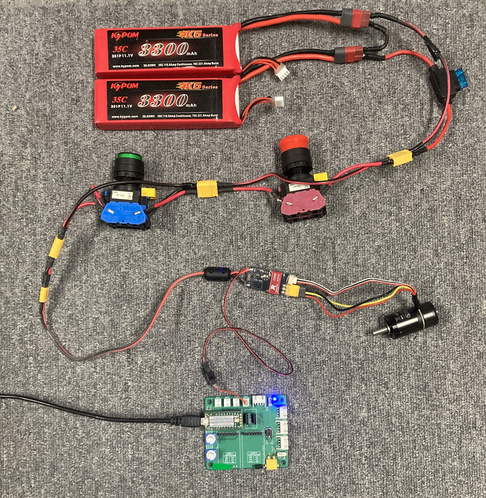

# ロボマスモーター

## 🌟 概要

CAN 通信経由で制御できるブラシレスモーターです。モータードライバと CAN 通信で接続します。

電流値を指定することで動作し、またエンコーダーを搭載しているため、回転数や回転角を取得できます。

モーターは ID で識別し、1 ~ 8 の範囲で指定します。

## 🌟 配線

電源は 24V です。M3508 (デカい方) もモータードライバ以外は同じ配線です。



## 🌟 ID 設定方法

### 全モーターの ID を一度に設定

1. モータードライバに電源を入れる
2. ドライバの SET ボタンを押し、もう一度長押しする (LED が黄緑色に点灯)
3. CAN バスに接続されているモーターを手で回すと、回した順に 1, 2, 3, ... と ID が設定される

### 個別に ID を設定

1. モータードライバに電源を入れる
2. ドライバの SET ボタンを押す
3. ドライバの ID 回ボタンを押す
4. ドライバの LED が ID 回点滅する

## 🌟 ファームウエア

ドキュメントにサンプルスケッチが載っています。

<https://github.com/udonrobo/UdonLibrary/blob/master/docs/Driver/RoboMasterMotor.md>

```cpp title="C620 ドライバ & Teensy4.0 で電流制御する例"
#include <Udon.hpp>

static Udon::CanBusTeensy<CAN2> bus;  // CAN2 ポートを使用

static Udon::RoboMasterC620 motor{ bus, 1 };  // モーターID: 1

void setup()
{
    bus.begin();
}

void loop()
{
    bus.update();

    motor.setCurrent(1000);  // 1000 mA で動作
}
```

## 🌟 気を付ける点

- ソースコードに対応した ID がモーターに設定されているか
- ソースコードに対応した CAN ポートに接続されているか (写真の基板の場合、CAN2)
- CAN 通信の終端抵抗が設定されているか
