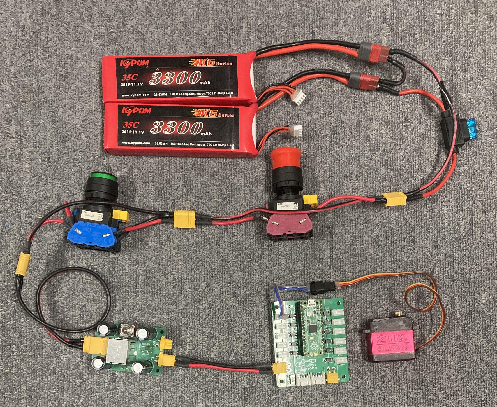

# サーボモーター

## 🌟 概要

PWM で制御信号を送ることで、指定した角度に回転するモーターです。

## 🌟 配線

部で使用しているサーボの定格電圧は 5V なので、DCDC コンバーターを介して降圧してから供給します。



## 🌟 ファームウエア

ピン番号は基板上に記載されています。

指定可能な角度はサーボによって異なります。よくあるタイプは 0 〜 180 度です。

=== "Raspberry Pi Pico で制御"

    `Udon::Servo` クラスを使って制御します。

    ```cpp
    #include <Udon.hpp>

    static Udon::Servo servo;

    void setup()
    {
        servo.attach(3);
    }

    void loop()
    {
        servo.write(0);
        delay(500);
        servo.write(45);
        delay(500);
    }
    ```

    !!! note "Arduino の Servo ライブラリとの違い"

        Raspberry Pi Pico 用 `Servo` ライブラリは PIO を使って PWM を出力します。
        
        Raspberry Pi Pico (RP2040) にはステートマシンが 8 つ搭載されているため、9 つ以上のサーボを制御することが出来ません。

        `Udon::Servo` クラスは PIO を使わずに PWM を出力するため、ステートマシン数の制限を受けません。

=== "Arduino マイコンで制御"

    `Servo` ライブラリを使って制御します。

    ```cpp
    #include <Servo.h>

    static Servo servo;

    void setup()
    {
        servo.attach(3);
    }

    void loop()
    {
        servo.write(0);
        delay(500);
        servo.write(45);
        delay(500);
    }
    ```
