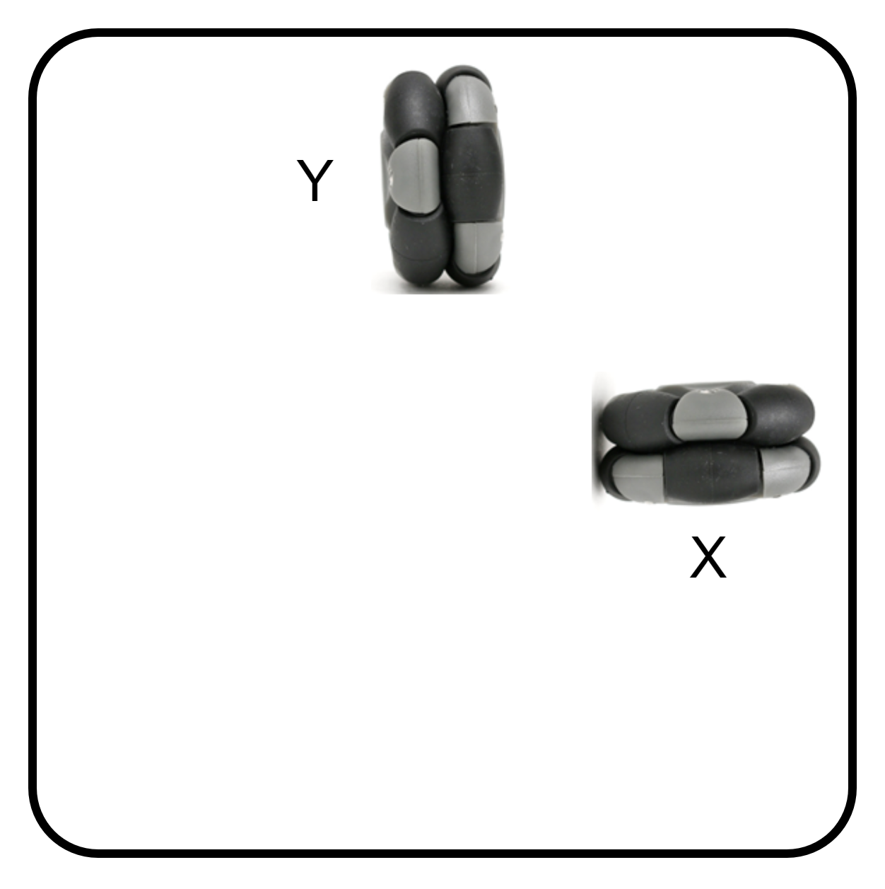

# 計測輪

計測輪から計測値を取得し、その値を基にロボットの自己位置を計測するアルゴリズムを紹介します。

自己位置はフィールドの座標系で計測します。

## 🌟 計測輪の配置

X 軸用の計測輪はロボットが X 軸方向へ移動したときオムニが回転し、Y 軸方向へ移動したときオムニが滑る方向に配置します。Y 軸用はその逆です。

{ width="300" }

## 🌟 考え方

ロボットは直線移動ではなく旋回しながら移動するため、x輪、y輪の計測輪の計測値を回転行列で変換するだけでは正しい位置を計測できません。

そこで計測値を微分し、細かい直線移動を繰り返していると考え、回転行列後の計測値を足し合わせていくことで座標を計測します。

## 🌟 ファームウエア

CAN バスには次の表のような `Udon::Message::Encoder` オブジェクトを配信するノードがいるとします。

| ID | 送信データ |
| --- | --- |
| 0x001 | x 軸測定用計測輪 |
| 0x002 | y 軸測定用計測輪 |

```cpp title="メインマイコンのファームウエア"
#include <Udon.hpp>

class CanEncoderReader
{
    Udon::CanReader<Udon::Message::Encoder> reader;

    int32_t count{};

public:
    CanEncoderReader(Udon::CanReader<Udon::Message::Encoder>& reader)
        : reader{ reader }
    {}

    /**
     * @brief カウント値の変化量を取得
     * @return カウント値の変化量
     */
    Udon::Optional<int32_t> getDeltaCount()
    {
        if (const auto message = reader.getMessage())
        {
            const int32_t prevCount = count;
            count = message->count;
            return count - prevCount;
        }
        else
        {
            Serial.println("[Error:Encoder] encoder node not found");
            return Udon::nullopt;
        }
    }
};

class Odometry
{
    CanEncoderReader xWheel;
    CanEncoderReader yWheel;
    Udon::BNO055 gyro;

    Udon::Pos pos;

public:
    Odometory(CanEncoderReader&& xWheel, CanEncoderReader&& yWheel, Udon::BNO055&& gyro)
        : xWheel{ std::move(xWheel) }
        , yWheel{ std::move(yWheel) }
        , gyro{ std::move(gyro) }
    {}

    /**
     * @brief センサーの初期化
     */
    void begin()
    {
        gyro.begin();
    }

    /**
     * @brief 自己位置をクリア
     */
    void clear()
    {
        pos.clear();
        gyro.clear();
    }

    /**
     * @brief 自己位置を取得
     * @return 自己位置 {{ x, y }, turn}
     */
    Udon::Optional<Udon::Pos> getPos()
    {
        gyro.update();

        const auto xDeltaOpt = xWheel.getDeltaCount();
        const auto yDeltaOpt = yWheel.getDeltaCount();
        
        if (not xDeltaOpt || not yDeltaOpt)
        {
            Serial.println("[Error:Odometry] encoder error");
            return Udon::nullopt;
        }

        static constexpr auto ppr = 8192;  // エンコーダー分解能
        static constexpr auto r   = 50.8;  // 計測輪直径

        const auto delta = Udon::Vec2{ *xDeltaOpt, *yDeltaOpt } * r * PI / ppr;

        pos.turn = gyro.getYaw();
        pos.vector += delta.rotated(pos.turn);

        return pos;
    }
};

static Udon::CanBusTeensy<CAN1> bus;

static Odometory odometry {
    Udon::CanEncoderReader{ bus, 0x001 },
    Udon::CanEncoderReader{ bus, 0x002 },
    Udon::BNO055{ Wire },
};

static Udon::LoopCycleController loopCtrl{ 10000 };

void setup()
{
    Serial.begin(115200);
    bus.begin();
    odometry.begin();
}

void loop()
{
    bus.update();

    if (const auto pos = odometry.getPos())
    {
        Serial.print(pos->vector.x); Serial.print('\t');
        Serial.print(pos->vector.y); Serial.print('\t');
        Serial.println(pos->turn);
    }
    else
    {
        Serial.println("[Error:Main] odometry error");
    }

    loopCtrl.update();
}
```
