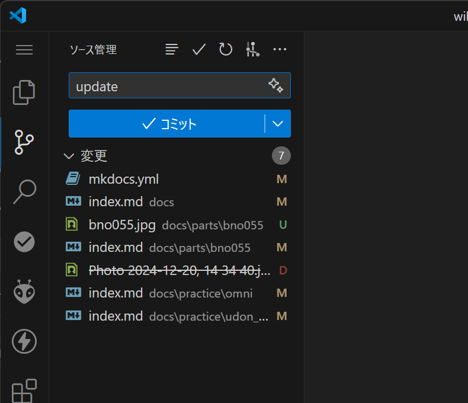

---
hide:
  - navigation
---

# wiki

香川高専高松キャンパス機械システム研究部 の wiki です。

本ページで取り上げている制御方法、定格電圧などのデータは、部で使用している部品のデータです。

<div class="grid cards" markdown>

- ### __部品__

    ---

    電源の構成方法、アクチュエータの配線、ファームウエアの実装例など

    [👉タブへ移動](./parts/power/config)

- ### __アルゴリズム__

    ---

    自己位置推定などのアルゴリズムの解説、実装例

    [👉タブへ移動](./algorithm/measure_wheel)

- ### __基板__

    ---

    基板の発注方法など

    [👉タブへ移動](./pcb/jlcpcb/)

- ### __講習会資料__

    ---

    [👉タブへ移動](./practice/index.md)

</div>

## ページ構成

このページは mkdocs と mkdocs-material によって生成され、GitHub Pages で配信しています。

内容はマークダウン形式で、[udonrobo/wiki](https://github.com/udonrobo/wiki) レポジトリで管理しています。

!!! note "mkdocs とは"

    マークダウンからホームページを生成する静的サイトジェネレーターです。[mkdocs ドキュメント](https://www.mkdocs.org/)

!!! note "mkdocs-material とは"

    mkdocs の拡張テーマです。 [mkdocs-material ドキュメント](https://squidfunk.github.io/mkdocs-material)

### 🌟 環境構築

適当なディレクトリで以下コマンドを実行し、mkdocs と mkdocs-material をインストールします。pip がインストールされていない場合、Python をインストールしてください。

??? note "Python インストール方法"

    [Python 公式サイト](https://www.python.org/downloads/) からインストーラーをダウンロードし、インストールしてください。もしくは Windows Package Manager (winget) を使用してインストールできます。

    ```sh
    winget install -i --id Python.Python.3.13
    ```

```sh
pip install mkdocs
pip install mkdocs-material
```

### 🌟 編集

udonrobo/wiki レポジトリをクローンし、

```sh
git clone https://github.com/udonrobo/wiki.git
```

VSCode 等で本レポジトリを開きます。

```sh
code wiki/
```

wiki レポジトリのディレクトリ下で以下コマンドを実行し、ローカルサーバーとブラウザを起動します。

```sh
python -m mkdocs serve --open
```

ホットリロードに対応しているため、マークダウンファイルを編集し保存すると、自動的に変更がブラウザに反映されます。

### 🌟 ファイルを追加

ファイルを追加する場合、docs ディレクトリ下に分類し、マークダウンファイルを作成してください。画像ファイルが含まれる可能性があるので、次のように 1 ページ 1 フォルダで管理すると見やすいです。

```
docs/
├── parts/
│   ├── 追加するページ名/
│   │   ├── index.md ← マークダウンファイル
│   │   └── 部品.jpg ← 画像ファイル
│   │...
│...
```

追加後、`wiki/mkdocs.yml` の `nav` にファイルをパスを追加すると、ナビゲーションバー (上部のメニューバー) からアクセスできるようになります。

```yml
nav:
  - ホーム: index.md
  - 部品:
    - アクチュエータ:
      - 追加するページ名: parts/追加するページ名/index.md
```

### 🌟 マークダウンの構文

マークダウンの構文はシンプルなので他のページのファイルを参照すると理解できると思います。mkdocs-material の拡張構文は [mkdocs-material ドキュメント](https://squidfunk.github.io/mkdocs-material/reference/) を参考にしてください。例えば次のようなマークダウンファイルを作成すると、右のタブのようなページが生成されます。

=== "Test.md"

        # テストページ
        
        <https://www.microsoft.com/>

        [Google](https://www.google.com)

        ## ファームウエア

        モーターを単体で動作させる場合の実装例です。

        ```cpp
        void setup() {}
        void loop() {}
        ```

        ## **mkdocs-material** の拡張構文   

        ```cpp title="Firmware.ino" linenums="1" hl_lines="3-6"
        void setup() {}

        void loop()
        {
        }
        ```

        <div class="grid" markdown>

        ```cpp title="Left.ino"
        void setup() {}
        void loop() {}
        ```

        ```cpp title="Right.ino"
        void setup() {}
        void loop() {}
        ```

        </div>

        === "タブA"

            タブAの内容

        === "タブB"

            タブBの内容

        === "タブC"

            タブCの内容

        !!! note

            ノート

        !!! warning "注意"

            ショートに注意！

=== "生成されたページ"

    # テストページ
    
    <https://www.microsoft.com/>

    [Google](https://www.google.com)

    ## ファームウエア

    モーターを単体で動作させる場合の実装例です。

    ```cpp
    void setup() {}
    void loop() {}
    ```

    ## **mkdocs-material** の拡張構文 

    ```cpp title="Firmware.ino" linenums="1" hl_lines="3-6"
    void setup() {}

    void loop()
    {
    }
    ```

    <div class="grid" markdown>

    ```cpp title="Left.ino"
    void setup() {}
    void loop() {}
    ```

    ```cpp title="Right.ino"
    void setup() {}
    void loop() {}
    ```

    </div>

    === "タブA"

        タブAの内容

    === "タブB"

        タブBの内容

    === "タブC"

        タブCの内容

    !!! note

        ノート

    !!! warning "注意"

        ショートに注意！

### 🌟 公開

GitHub へプッシュすると GitHub Actions によって自動的に公開されます。

VSCode の場合、Git タブで変更内容をコミットし、変更の同期を押すと GitHub へプッシュできます。

{ width="500" }

## 免責

本サイトの掲載内容で生じた損害に対する一切の責任を負いません。
