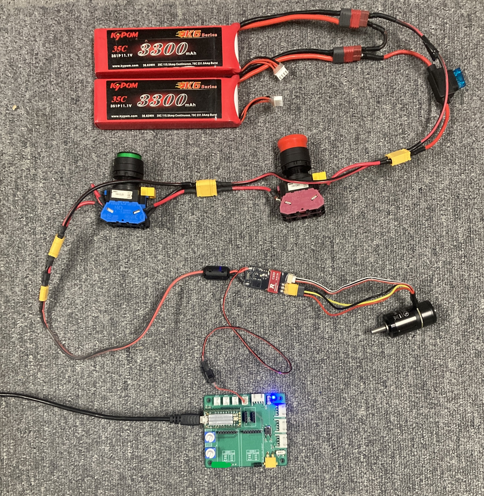

# ロボマスモーター

## 🌟 概要

CAN 通信経由で制御できるブラシレスモーターです。モータードライバと CAN 通信で接続します。

電流値を指定することで動作し、またエンコーダーを搭載しているため、回転数や回転角を取得できます。

モーターは ID で識別し、1 ~ 8 の範囲で指定します。

## 🌟 配線

電源は 24V です。M3508 (デカい方) もモータードライバ以外は同じ配線です。



!!! note "終端抵抗"

    CAN 通信には終端抵抗が2個必要です。基板上の終端抵抗スイッチを入れるか、モータードライバの終端抵抗スイッチを入れてください。

## 🌟 ID 設定方法

### 全モーターの ID を一度に設定

1. モータードライバに電源を入れる
2. ドライバの SET ボタンを押し、もう一度長押しする (LED が黄緑色に点灯)
3. CAN バスに接続されているモーターを手で回すと、回した順に 1, 2, 3, ... と ID が設定される

### 個別に ID を設定

1. モータードライバに電源を入れる
2. ドライバの SET ボタンを押す
3. ID 回 SET ボタンを押す
4. ドライバの LED が ID 回点滅する

## 🌟 ファームウエア

モーター 1 つにつき、`Udon::RoboMasterCxxx` インスタンスを 1 つ作成します。ドキュメントに速度制御などのスケッチ例が載っています。

<https://github.com/udonrobo/UdonLibrary/blob/master/docs/Driver/RoboMasterMotor.md>

```cpp title="C610 ドライバ & Teensy4.0 で電流制御する例"
#include <Udon.hpp>

static Udon::CanBusTeensy<CAN2> bus;  // CAN2 ポートを使用

static Udon::RoboMasterC610 motor{ bus, 1 };  // モーターID: 1

void setup()
{
    bus.begin();
}

void loop()
{
    bus.update();

    motor.setCurrent(1000);  // 1000 mA で動作 (C610 の場合 -10000~10000)
}
```

!!! note "気を付ける点"

    - ソースコードに対応した ID がモーターに設定されているか
    - ソースコードに対応した CAN ポートに接続されているか (写真の基板の場合、CAN2)
