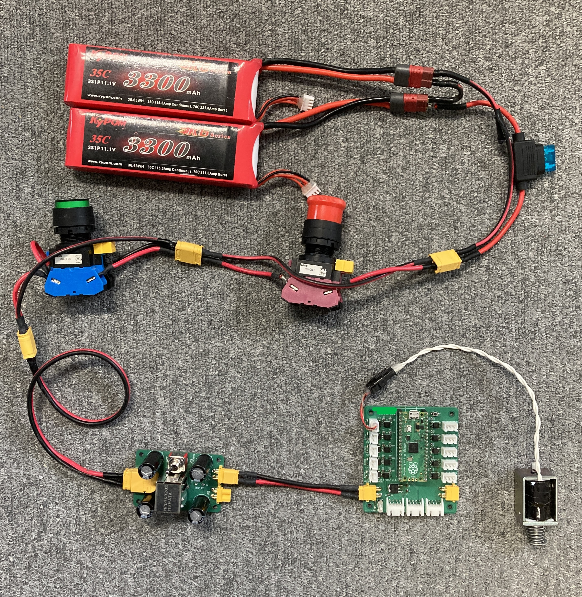

# ソレノイド

## 🌟 概要

電磁石を用いて機械的な動作を行うアクチュエータです。

## 🌟 配線

画像のソレノイドは定格電圧 12V です。極性はありません。

部には複数のソレノイドがあるので詳細は公式ページを参照してください。[タカハソレノイド 公式ページ](https://www.takaha.co.jp/)



## 🌟 ファームウエア

```cpp
const int pin = 2;

void setup()
{
    pinMode(pin, OUTPUT);
}

void loop()
{
    digitalWrite(pin, HIGH);
    delay(100);
    digitalWrite(pin, LOW);
    delay(1000);
}
```

!!! warning

    長時間電流を流すと発熱するため、1 秒以上連続で ON にしないようにしてください。
