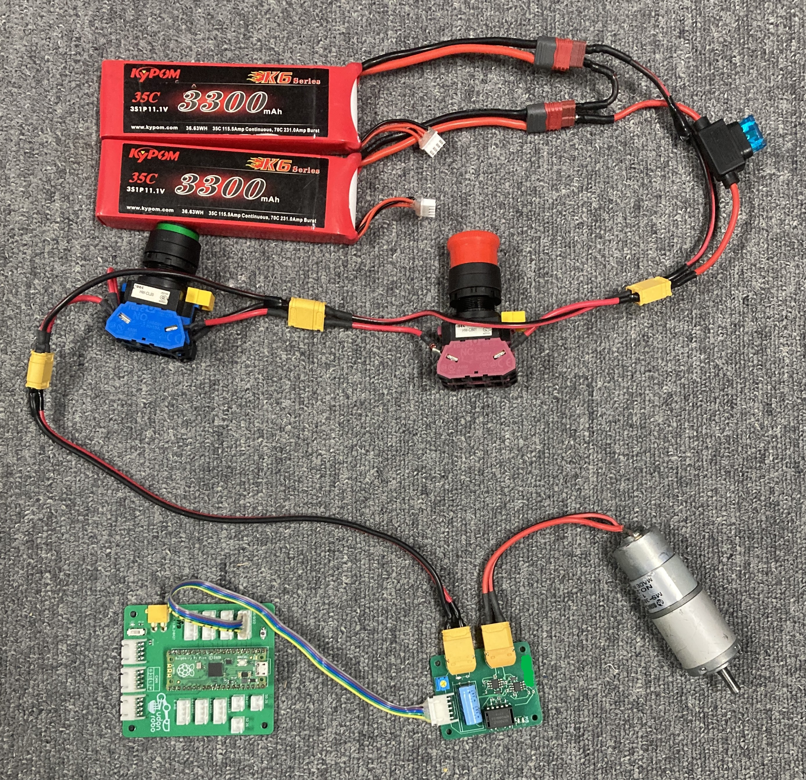
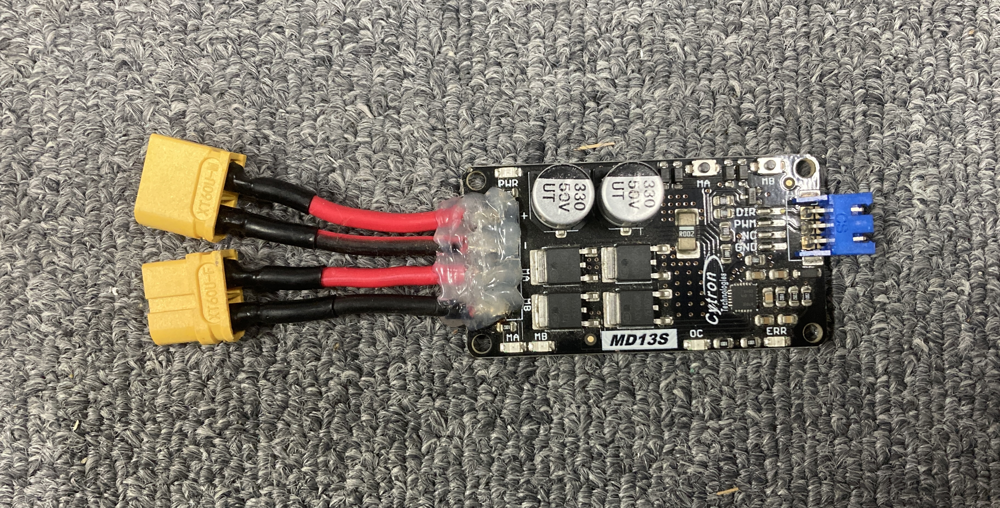
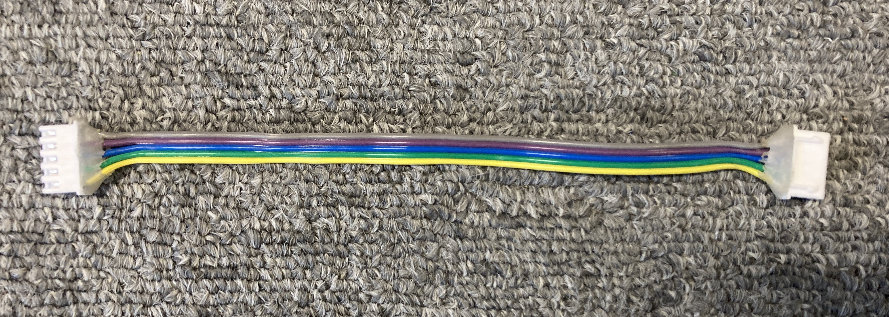

# DC モーター

## 🌟 概要

直流電源を供給することで回転します。モータードライバを介して制御します。

## 🌟 配線

マブチ 385 モータの場合の配線図です。モーターによって定格電圧が異なるので、適切な電圧を供給してください。この場合は 24V です。

=== "小電流用"

    

=== "大電流用"

    

=== "制御線が 2 線のタイプ"

    DIR 線と PWM 線の 2 線のタイプです。あまり使わないので配線図は割愛します。

    

    

=== "制御線"

    

## 🌟 ファームウエア / 制御線 3 線

ピン番号は基板上に記載されています。

=== "最小構成"

    ```cpp
    const int pinA = 0;
    const int pinB = 2;
    const int pinP = 1;

    void setup()
    {
        pinMode(pinA, OUTPUT);
        pinMode(pinB, OUTPUT);
    }

    void loop()
    {
        digitalWrite(pinA, HIGH);
        digitalWrite(pinB, LOW);
        analogWrite(pinP, 100);  // 0~255 の範囲でPWM出力
    }
    ```

=== "Udon::Motor3 クラスを使う"

    ```cpp
    #include <Udon.hpp>

    static Udon::Motor3 motor{ 0, 2, 1 };

    void setup()
    {
        motor.begin();
    }

    void loop()
    {
        motor.move(100);
    }
    ```

## 🌟 ファームウエア / 制御線 2 線

=== "最小構成"

    ```cpp
    const int pinA = 0;
    const int pinP = 1;

    void setup()
    {
        pinMode(pinA, OUTPUT);
    }

    void loop()
    {
        digitalWrite(pinA, HIGH);
        analogWrite(pinP, 100);  // 0~255 の範囲でPWM出力
    }
    ```

=== "Udon::Motor2 クラスを使う"

    ```cpp
    #include <Udon.hpp>

    static Udon::Motor2 motor{ 0, 1 };

    void setup()
    {
        motor.begin();
    }

    void loop()
    {
        motor.move(100);
    }
    ```

## 🌟 実際のコード例

メインマイコンから CAN で出力値を受信し、サブマイコンでモーターを制御する例です。

一つのモーターにつき、一つの CNA ID を割り当てて制御します。

```cpp title="サブマイコン側 (Raspberry Pi Pico)"
#include <Udon.hpp>

class CanMotorReader
{
    Udon::CanReader<Udon::Message::Motor> canReader;
    Udon::Motor3 motor;

public:
    CanMotorReader(Udon::CanReader<Udon::Message::Motor>&& canReader, Udon::Motor3&& motor)
        : canReader{ std::move(canReader) }
        , motor{ std::move(motor) }
    {
    }

    void begin()
    {
        motor.begin();
    }

    void update()
    {
        if (const auto message = canReader.getMessage())
        {
            motor.move(message->speed);
        }
        else
        {
            motor.stop();
        }
    }
};

static Udon::CanBusSpi bus;

static CanMotorReader motors[] {
    CanMotorReader{ 
        Udon::CanReader<Udon::Message::Motor>{ bus, 0x001 },
        Udon::Motor3{ 0, 2, 1 }
    },
    CanMotorReader{ 
        Udon::CanReader<Udon::Message::Motor>{ bus, 0x002 },
        Udon::Motor3{ 3, 5, 4 }
    },
    CanMotorReader{ 
        Udon::CanReader<Udon::Message::Motor>{ bus, 0x003 },
        Udon::Motor3{ 6, 8, 7 }
    },
    CanMotorReader{ 
        Udon::CanReader<Udon::Message::Motor>{ bus, 0x004 },
        Udon::Motor3{ 9, 11, 10 }
    },
};

static Udon::LoopCycleController loopCtrl{ 10000 };

void setup()
{
    bus.begin();

    for (auto& motor : motors)
    {
        motor.begin();
    }
}

void loop()
{
    bus.update();

    for (auto& motor : motors)
    {
        motor.update();
    }

    loopCtrl.update();
}
```

```cpp title="メインマイコン側 (Teensy4.0)"
#include <Udon.hpp>

class CanMotorWriter
{
    Udon::CanWriter<Udon::Message::Motor> canWriter;

public:
    CanMotorWriter(Udon::CanWriter<Udon::Message::Motor>&& canWriter)
        : canWriter{ std::move(canWriter) }
    {
    }

    void move(int16_t power)
    {
        canWriter.setMessage({ power });
    }

    void stop()
    {
        move(0);
    }
};

static Udon::CanBusTeensy<CAN1> bus;

static CanMotorWriter motors[] {
    CanMotorWriter{{ bus, 0x001 }},
    CanMotorWriter{{ bus, 0x002 }},
    CanMotorWriter{{ bus, 0x003 }},
    CanMotorWriter{{ bus, 0x004 }},
};

static Udon::LoopCycleController loopCtrl{ 10000 };

void setup()
{
    bus.begin();
}

void loop()
{
    bus.update();

    motors[0].move(100);
    motors[1].move(200);
    motors[2].move(-100);
    motors[3].move(-200);

    loopCtrl.update();
}
```
