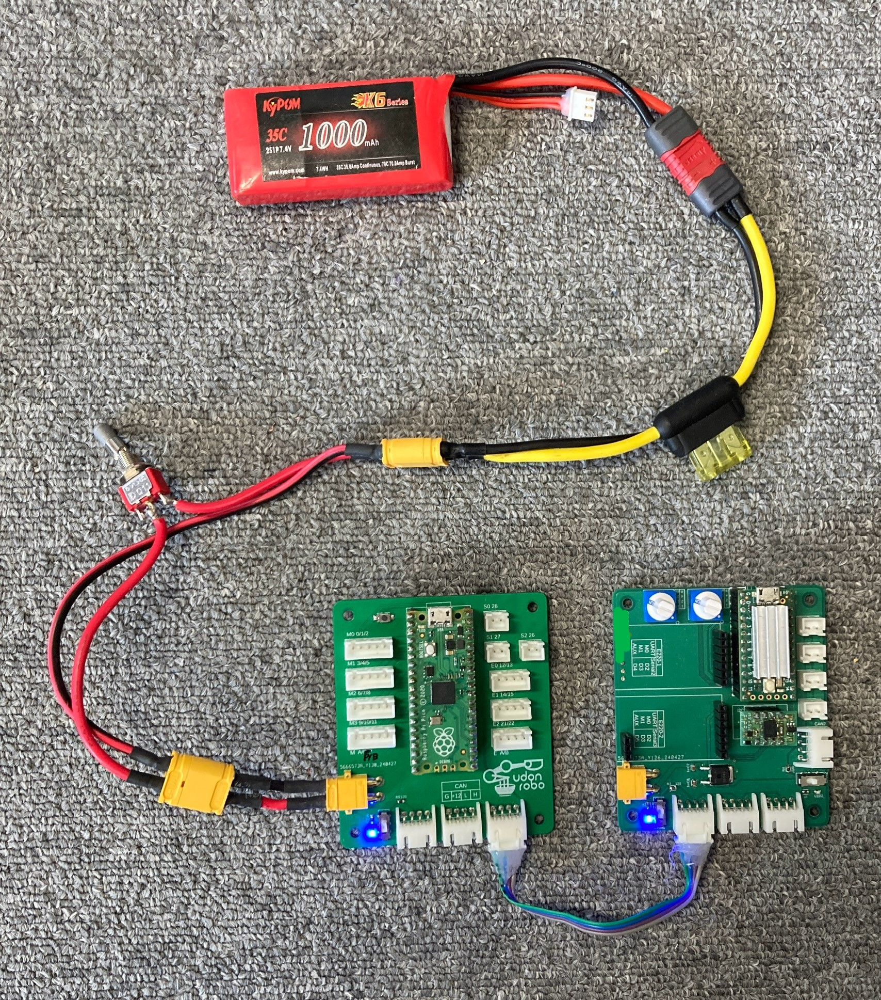
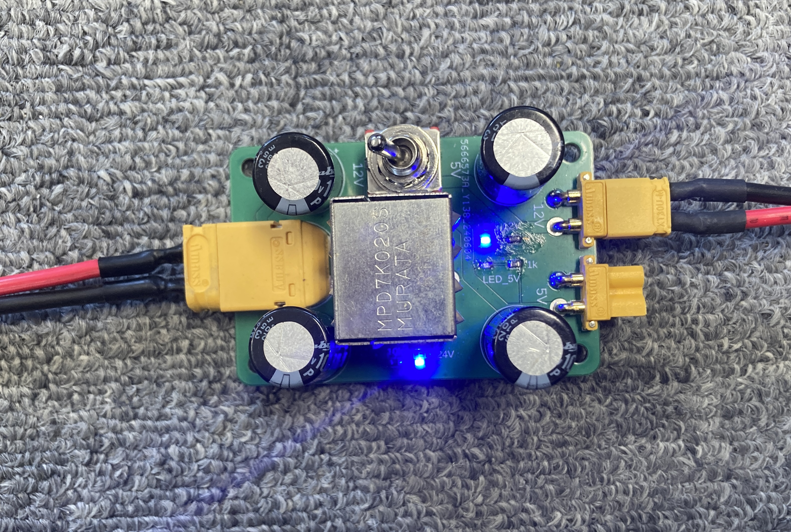
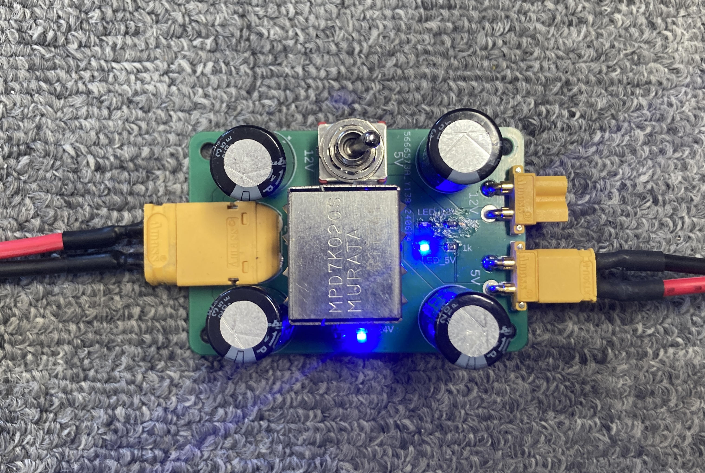

# 電源の構成

ロボットの電源は回路電源と駆動電源に分かれます。回路電源はマイコン、センサー、通信機器など用の電源です。駆動電源はアクチュエータを駆動するための電源です。アクチュエータから発生するノイズが回路に影響を与えないように分かれています。

部では電源に主にリポバッテリーを使用しています。非常に大きな電流を取り出すことができ危険なため、ヒューズをつけ一定の電流値を超えたら回路を遮断するように配線します。

## 回路電源

2 セルのリポバッテリーから電源を取ります。基板上の電源端子(XT30)に接続します。

基板間の通信線を介して電源が供給されるため、どれか 1 つの基板に接続するだけで大丈夫です。

供給された回路電源は各基板でマイコンの適正電圧に降圧されます。

## 駆動電源

ロボコンのルール上、非常スイッチを 2 個以上通し、常用スイッチを 1 つ通す必要があります。

### 🌟 24V の取り方

3 セルのリポバッテリーを 2 つ直列に接続すると 24V 電源になります。

複数のアクチュエータに電源を供給する場合、常用スイッチより先から並列に分岐して接続します。

### 🌟 12V の取り方

DCDC コンバーターで 24V から 12V に降圧します。

ソレノイド、電磁弁などを駆動する際は 12V 電源を使用します。

!!! note "24V の駆動電源を使用しない場合"

    DCDC コンバーターを使用せず、バッテリーから直接 12V を取り出しても良いです。

### 🌟 5V の取り方

DCDC コンバーターで 24V から 5V に降圧します。

サーボモーター、シリアル LED などを駆動する際は 5V 電源を使用します。

