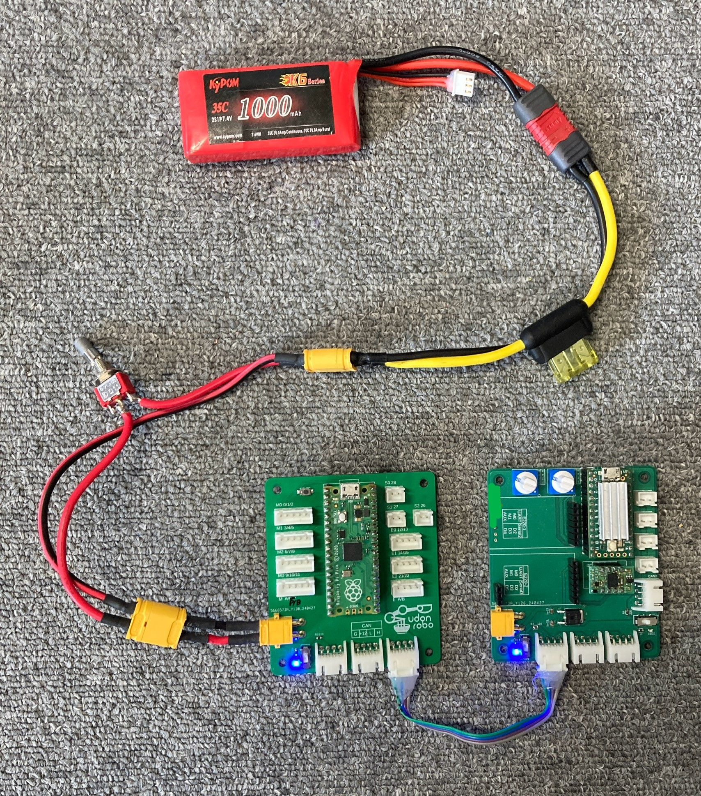
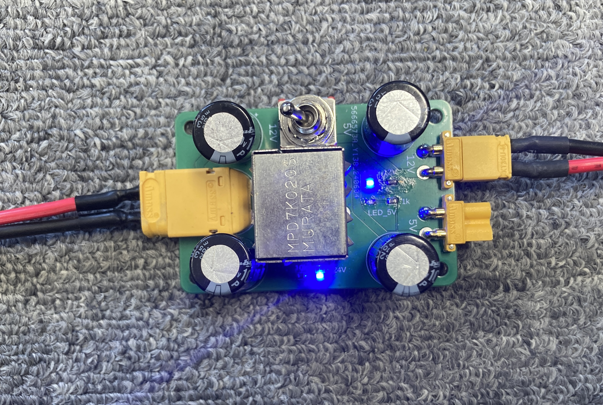

# 電源

部では電源に主にリポバッテリー(リチウムイオンポリマーバッテリー)を使用しています。非常に大きな電流を取り出せ危険なため、一定の電流値を超えたら回路を遮断するヒューズを必ずつけてください。

ロボットの電源は回路電源と駆動電源に分かれます。アクチュエータから発生するノイズが回路電源に影響を与えないように分かれています。

## 回路電源

2 セルのリポバッテリーから電源を取ります。基板上の電源端子(XT30)に接続します。

駆動電源とは別系統で配線します。

## 駆動電源

ロボコンのルール上、非常停止スイッチを 2 個以上通し、常用スイッチを 1 つ通す必要があります。

### 🌟 24V の取り方

3 セルのリポバッテリーを 2 つ直列に接続すると 24V 電源になります。

複数のアクチュエータに電源を供給する場合、常用スイッチより先から並列に分岐して接続します。

### 🌟 12V の取り方

DCDC コンバーターで 24V から 12V に降圧します。

ソレノイド、電磁弁などを駆動する際は 12V 電源を使用します。

!!! note "24V の駆動電源を使用しない場合"

    DCDC コンバーターを使用せず、バッテリーから直接 12V を取り出しても良いです。

### 🌟 5V の取り方

DCDC コンバーターで 24V から 5V に降圧します。

サーボモーター、シリアル LED などを駆動する際は 5V 電源を使用します。

