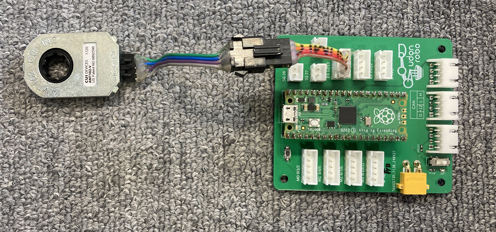
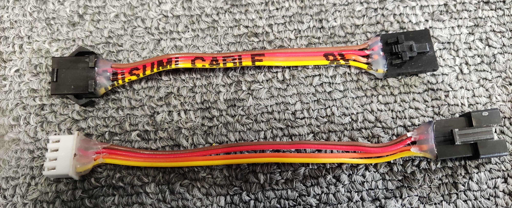

# ロータリーエンコーダー

## 🌟 概要

回転角度を測定するセンサーです。

## 🌟 配線

=== "全体図"

    

=== "中継用配線"

    

## 🌟 最小構成のコード例

測定角度はカウント値として取得できます。一周分のカウント値はエンコーダーの分解能によって決まります。

=== "Raspberry Pi Pico で制御"

    ```cpp
    #include <Udon.hpp>

    static Udon::EncoderPico encoder{ 12, 13 };  // A, B ピン番号

    void setup()
    {
        Serial.begin(115200);
        encoder.begin();
    }

    void loop()
    {
        const int32_t count = encoder.read();
        
        Serial.println(count);

        delay(10);
    }
    ```

    !!! warning

        A, B ピンは隣り合っている必要があります。

    !!! note

        PIO を使って計測します。そのためエンコーダーは最大 8 個まで接続できます。

=== "Teensy で制御"

    ```cpp
    #include <Encoder.h>

    static Encoder encoder{ 0, 1 };  // A, B ピン番号

    void setup()
    {
        Serial.begin(115200);
        encoder.begin();
    }

    void loop()
    {
        const int32_t count = encoder.read();

        Serial.println(count);
        
        delay(10);
    }
    ```

## 🌟 実際のコード例

サブマイコンでエンコーダーのカウント値を計測し、CAN でメッセージを送信する例です。

一つのエンコーダーにつき、一つの CNA ID を持たせて送信します。

```cpp title="サブマイコン側 (Raspberry Pi Pico)"
#include <Udon.hpp>

/// @brief エンコーダーのカウント値をCANへ送信するクラス
class CanEncoderWriter
{
    Udon::EncoderPico                       encoder;    // エンコーダー
    Udon::CanWriter<Udon::Message::Encoder> canWriter;  // CAN 送信者

public:
    CanEncoderWriter(Udon::EncoderPico&& encoder, Udon::CanWriter<Udon::Message::Encoder>&& canWriter)
        : encoder{ std::move(encoder) }
        , canWriter{ std::move(canWriter) }
    {
    }

    void begin()
    {
        encoder.begin();
    }

    void update()
    {
        canWriter.setMessage({ encoder.read() });  // エンコーダーのカウント値を取得し、CAN へ送信
    }
};


// CAN バス
static Udon::CanBusSpi bus;

// ロータリーエンコーダー4つ
static CanEncoderWriter encoders[] {
    CanEncoderWriter {   
        Udon::EncoderPico{ 12, 13 },                            // 12, 13 ピンのエンコーダーを読み、
        Udon::CanWriter<Udon::Message::Encoder>{ bus, 0x001 }   // CAN ID 0x001 で送信
    },
    CanEncoderWriter {
        Udon::EncoderPico{ 14, 15 },                            // 14, 15 ピンのエンコーダーを読み、
        Udon::CanWriter<Udon::Message::Encoder>{ bus, 0x002 }   // CAN ID 0x002 で送信
    },
    CanEncoderWriter {
        Udon::EncoderPico{ 16, 17 },
        Udon::CanWriter<Udon::Message::Encoder>{ bus, 0x003 }
    },
    CanEncoderWriter {
        Udon::EncoderPico{ 18, 19 },
        Udon::CanWriter<Udon::Message::Encoder>{ bus, 0x004 }
    },
};

// ループ周期を一定に制御するクラス
static Udon::LoopCycleController loopCtrl{ 1000 };

void setup()
{
    bus.begin();

    for (auto& encoder : encoders)
    {
        encoder.begin();
    }
}

void loop()
{
    bus.update();

    for (auto& encoder : encoders)
    {
        encoder.update();
    }

    loopCtrl.update();
}
```

```cpp title="メインマイコン側 (Teensy4.0)"
#include <Udon.hpp>

/// @brief CAN を介してエンコーダーのカウント値を得るクラス
class CanEncoderReader
{
    Udon::CanReader<Udon::Message::Encoder> canReader;

public:
    CanEncoderReader(Udon::CanReader<Udon::Message::Encoder>&& canReader)
        : canReader{ std::move(canReader) }
    {
    }

    /// @brief カウント値取得
    Udon::Optional<int32_t> getCount() const
    {
        return canReader
            .getMessage()
            .transform([](const auto& message) { return message.count; });  // Udon::Optional<Udon::Message::Encoder> から Udon::Optional<int32_t> に変換
    }
};


// CAN バス
static Udon::CanBusTeensy<CAN1> bus;

// ロータリーエンコーダー4つ
static CanEncoderReader encoders[] {
    CanEncoderReader{{ bus, 0x001 }},
    CanEncoderReader{{ bus, 0x002 }},
    CanEncoderReader{{ bus, 0x003 }},
    CanEncoderReader{{ bus, 0x004 }},
};

// ループ周期を一定に制御するクラス
static Udon::LoopCycleController loopCtrl{ 10000 };

void setup()
{
    Serial.begin(115200);
    bus.begin();
}

void loop()
{
    bus.update();

    for (auto& encoder : encoders)
    {
        if (const auto count = encoder.getCount())
        {
            Serial.println(*count);
        }
        else
        {
            Serial.println("Encoder node not found");
        }
    }

    loopCtrl.update();
}
```
