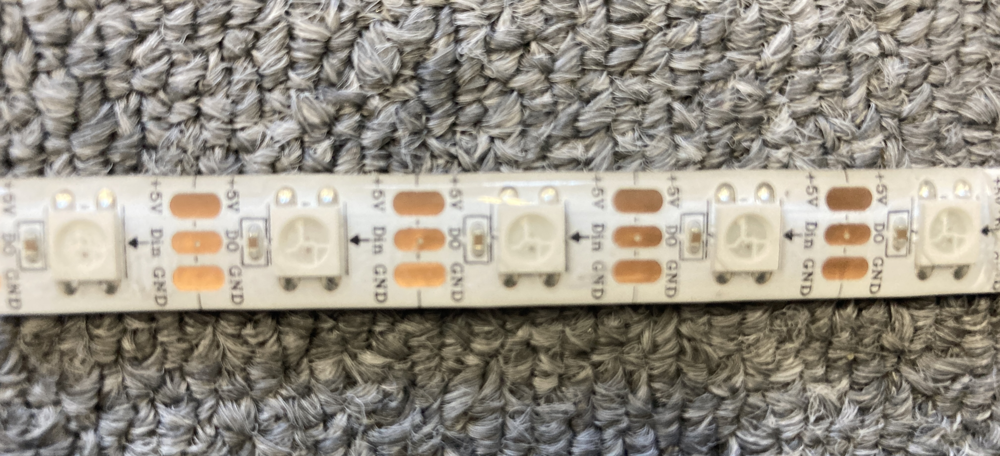

# シリアル LED



## 🌟 概要

デイジーチェーン接続できるシリアル LED です。そのため制御線 1 本で複数の LED を制御できます。

## 🌟 配線

定格電圧は 5V です。

!!! warning

    信号の流れる方向が決まっています。LED にはんだづけする際は、記載の矢印の方向へ信号が流れるよう、配線してください。

=== "全体"

    

=== "アップ"

    写真の基板はコネクタの配列がおかしいため、LEDとの接続部分を交差させています。

    

## 🌟 ファームウエア

[Adafruit の NeoPixel ライブラリ](https://github.com/adafruit/Adafruit_NeoPixel) を使用します。

??? note "追加していない場合"

    ライブラリを追加していない場合、ライブラリフォルダに追加してください。

    ```sh
    cd ~/Documents/Arduino/libraries
    git clone https://github.com/adafruit/Adafruit_NeoPixel.git
    ```

```cpp title="RaspberryPi Pico での使用例"
#include <Adafruit_NeoPixel.h>

const int pin  = 0;    // 制御線のピン番号
const int nLed = 20;   // LED の数

static Adafruit_NeoPixel leds{ nLed, pin };

void setup()
{
    leds.begin();
    leds.setBrightness(50);  // 最大出力は明るすぎるので調整
}

void loop()
{
    for (int i = 0; i < leds.numPixels(); ++i)
    {
        leds.setPixelColor(i, 0xaaaaaa);
    }

    leds.show();

    delay(10);
}
```
