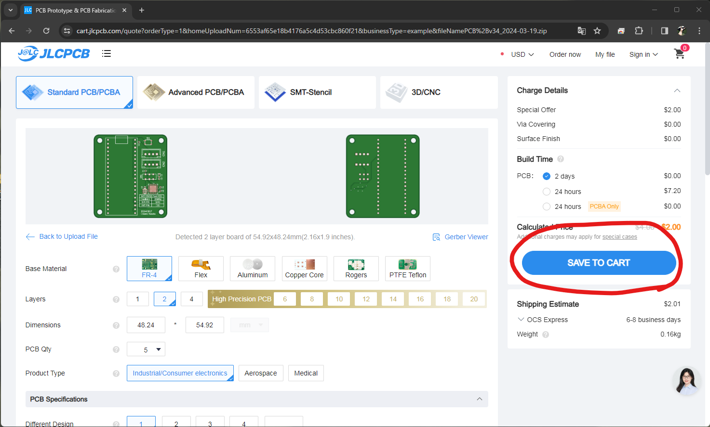
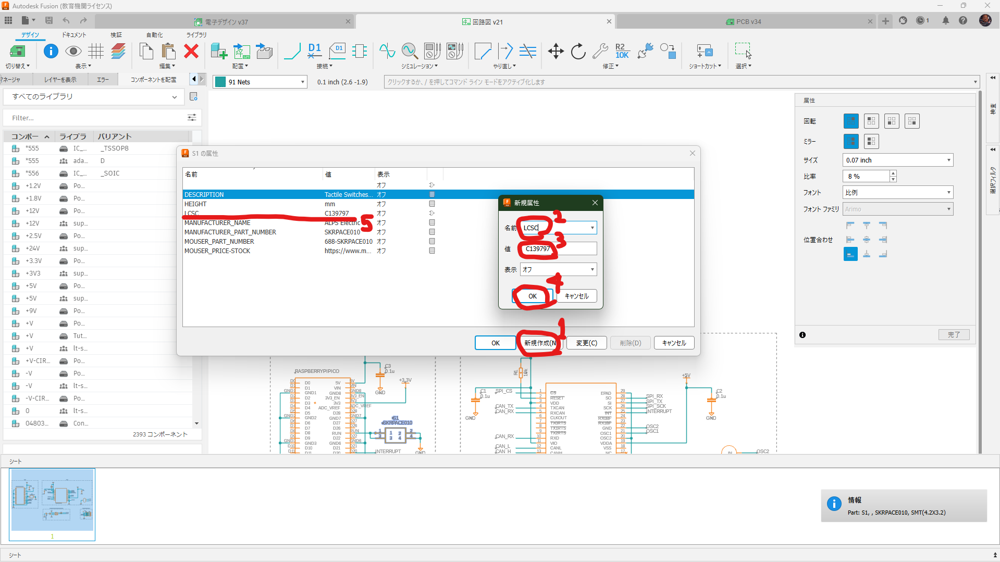

# JLCPCB 注文手順

## 通常基板の発注

### 🌟 発注の流れ

1. Fusion360 からガーバーファイル(.zip)を出力

2. JLCPCB にアップロードし支払い

### 🌟 発注手順

#### 1. CAM プロセッサを起動

ボードエディタ > 製造タブ > CAM プロセッサ


#### 2. CAM テンプレート選択


#### 3. ジョブを処理


#### 4. 出力先を指定し、ガーバーファイルを出力


#### 5. JLCPCB にアップロード

[JLCPCB](https://jlcpcb.com) を開く > `Add gerber file` に 4 で作成した zip ファイルを投げる


#### 6. カートに追加

基板の色などを選択しカートに追加します。基板の枚数はここで指定します。



#### 7. 支払い

カートに移動しチェックアウトします。

!!! note

    デフォルトで選択されている配送業者は送料が高いので注意

    ANA 傘下の OSC Express, NEP を使用するのがおすすめです。 (1~2$)


## PCB アセンブリの発注

### 🌟 予備知識

- 実装する部品はなるべく基本部品を選ぶ。

  拡張部品は実装装置に部品をセットする必要があるため、基板 1 種類につき 3$ の初期費用が掛かります。

  基本部品は常に実装装置にセットされているため、初期費用は掛かりません。

- 基板設計時に JLCPCB に部品があるかどうか、在庫が十分か確認する。

- 両面実装は高価なのでなるべく片面実装にする。

- 部品の設置位置や設置角度がズレている場合があるので、注文時のプレビュー画面をよく確認する。

### 🌟 発注の流れ

1. 各部品に LCSC 部品番号属性を付与

2. Fusion360 からガーバーファイル(.zip), BOM(.csv), CPL(.csv) ファイルを出力

3. JLCPCB にアップロードし支払い

### 🌟 発注手順

#### 1. 属性エディタを開く

部品を右クリック > 属性


#### 2. 部品番号属性を付与

`LCSC` という名前の属性を新規作成し、対応する LCSC 部品番号を値に追加します。

部品番号は JLCPCB のサイトで検索できます。

1 > 2 の流れを、実装してほしい部品全てに対して行う。



#### 3. ULP スクリプトをダウンロード

ターミナル等を用いて適当なディレクトリに <https://github.com/oxullo/jlcpcb-eagle> をクローンします。

```sh
git clone https://github.com/oxullo/jlcpcb-eagle.git
```

このレポジトリに含まれている ULP スクリプトを実行することで BOM, CPL ファイルが得られます。BOM ファイルは部品表、CPL ファイルは各部品の配置座標を記録しています。

!!! note

    ターミナルを使用しない場合、以下の手順で zip ファイルとしてダウンロード可能です。

    

#### 4. ULP スクリプトを実行

ボードエディタを起動 > 自動化 > ULP > 参照

3 でダウンロードした `jlcpcb-eagle` にある `jlcpcb-eagle/ulps/jlcpcb_smta_exporter.ulp` を選択

※ボードエディタ内で実行する必要があります。

実行後、指定したディレクトリに BOM ファイル (\*\_bom.csv), CPL ファイル(\*\_cpl.csv) が生成されていれば成功です。


#### 5. ガーバーファイルを JLCPCB にアップロードする

通常基板の発注の手順 1~5 と同じです。まだカートに追加しません。

#### 6. PCB アセンブリを選択する

部品を実装する面を選択


#### 7. BOM, CPL ファイルアップロード

4 で作成した BOM, CPL ファイルをアップロード


#### 8. 実装部品確認

部品表が表示されるため確認します。LCSC 部品番号を登録していない場合警告されます。

!!! note

    Fusion 側で `DNP` 属性を付与することで、部品を登録しないことを明示できます。

    oxullo/jlcpcb-eagle README.md より

    _In case a part should not be exported into the BOM/CPL, add an attribute called "DNP" (the value is not relevant and can be an annotation for the reason for the exclusion). The POPULATE flag is also taken into consideration for filtering out parts that shouldn't be part of a specific variant._

    部品が BOM/CPL にエクスポートされるべきではない場合、"DNP" という属性を追加します（値は関係なく、除外の理由の注釈にすることができます）。POPULATE フラグも、特定のバリアントの一部であるべきでない部品をフィルタリングするために考慮されます。


#### 9. 実装後プレビュー確認

実装後のプレビューが表示されるため確認します。配置角度が違う場合があるため注意が必要です。

!!! warning

    位置がずれている場合、ボードなどを保存せず BOM, CPL を出力している可能性があります。

    角度のずれは `JLC_ROTATION` 属性を付与し、値にオフセット角度を設定することで修正可能です。

    oxullo/jlcpcb-eagle README.md より

    _The ULP can also manually rotate the angle in the CPL output file. The attribute must be named JLC_ROTATION. For example, if a part's angle in set to 90 and it's attribute JLC_ROTATION is set to 180, the angle in the final CPL file will be set to 270._

    ULP は、CPL 出力ファイルの角度を手動で回転することもできる。属性の名前は JLC_ROTATION でなければならない。たとえば、パーツの角度が 90 に設定され、属性の JLC_ROTATION が 180 に設定されている場合、最終的な CPL ファイルの角度は 270 に設定される。


使用用途を指定しカートに追加します。


#### 10. 支払い

通常基板の発注の 7 と同じく支払いを行います。
