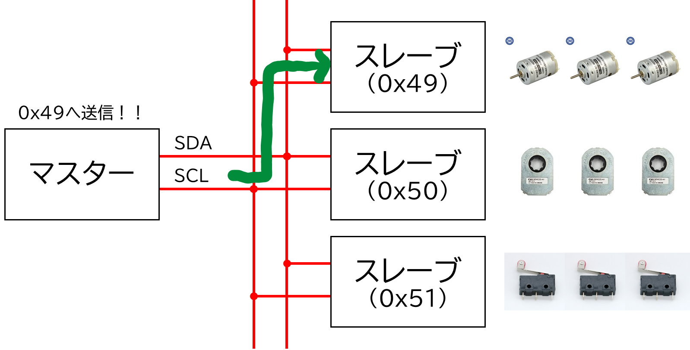
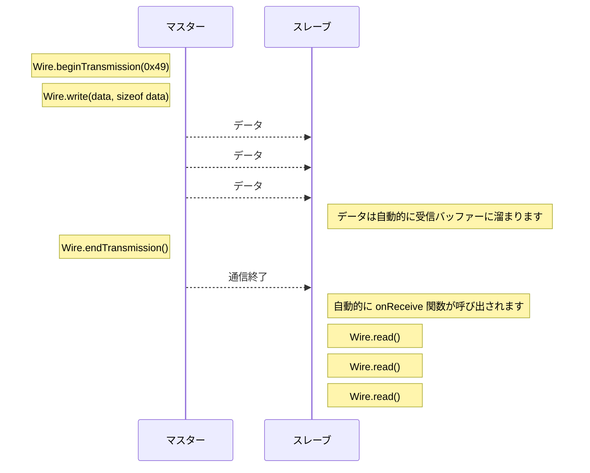
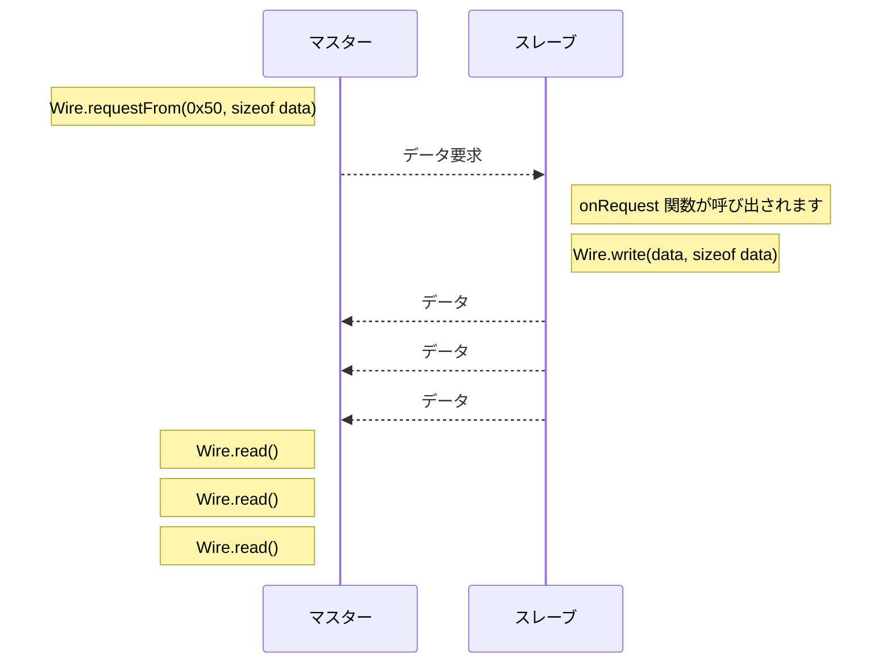
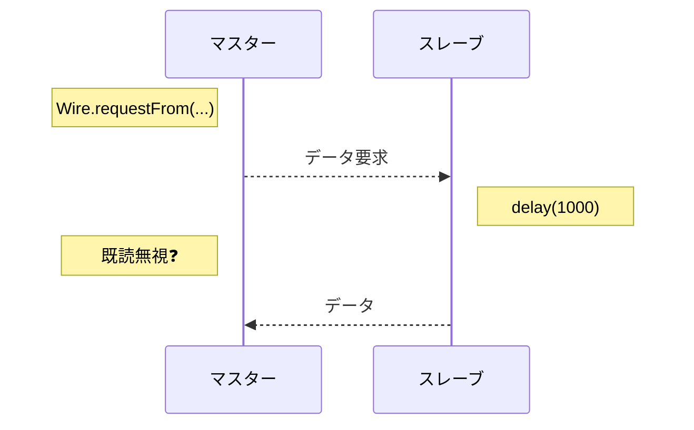
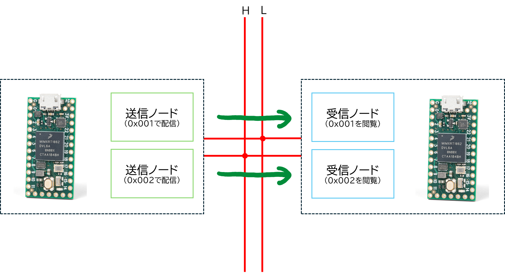

# 通信について

マイコン間でデータの受け渡しを行う際に用います。

I2C, SPI, CAN, UART, USB, Ethernet などの通信プロトコルがあります。

部では 2022 年まで I2C 通信を使っていましたが、通信エラーに悩まされた末、2023 年からは CAN 通信を使うことになりました。

## 具体的に何を行うか

ファームウエアの世界から通信から見ると、通信とはバイト列の送受信です。

※物理世界から見ると、通信とは 0 と 1 の電気信号のやり取りです。

<div class="grid" markdown>

```cpp title="送信側イメージ"
uint8_t data[3] = { 0x00, 0x01, 0x02 };

write(data);
```

```cpp title="受信側イメージ"
uint8_t data[3];

read(data);

// data == { 0x00, 0x01, 0x02 }
```

</div>

## I2C 通信

<div class="grid" markdown>

- {==基板内==}用の通信
- {==一対多==}・バス方式
- アドレスによって通信相手を識別
- {==主従関係がある==}
- 大抵のマイコンには I2C の回路が内蔵されており、ピン同士を繋げるだけで通信できる為、回路は簡単


</div>

### 🌟 ロボコンでの構成

マイコン 1 台がマスター、他のマイコンがスレーブとなります。

マスターで主要な処理を行い、スレーブにはモーターの制御など補助的な処理を行わせます。

I2C の性質上、マイコン 1 台に 1 つのアドレスを割り当てます (次で紹介する CAN 通信では複数の ID を割り振れます)


### 🌟 マスターからスレーブへ送信する場合

スレーブのアドレスを指定し、データを送信します。



マスター側のソースコード

```cpp
#include <Wire.h>

void setup()
{
    Wire.begin(); // 通信開始
}

void loop()
{
    uint8_t data[3] = { 0x00, 0x01, 0x02 };

    Wire.beginTransmission(0x49);  // 0x49 へ送信開始
    Wire.write(data, sizeof data); // バイト列を送信
    Wire.endTransmission();        // 送信終了

    delay(10);
}
```

スレーブ側のソースコード

```cpp
#include <Wire.h>

uint8_t data[3];

// データ受信時に呼び出される関数
void onReceive(int)
{
    while (Wire.available())  // データがある間
    {
        for (uint8_t& d : data)
        {
            d = Wire.read();  // データを取り出す
        }
    }
}

void setup()
{
    Wire.begin(0x49);           // 0x49 のアドレスで通信開始
    Wire.onReceive(onReceive);  // データ受信時、onReceive 関数を呼び出すように設定
}

void loop()
{
    // 何もしない
}
```

通信過程のイメージ



### 🌟 スレーブからマスターへ

スレーブは自発的にデータを送信しません。マスターがデータを要求し、スレーブがそれに応じてデータを送信します。


マスター側のソースコード

```cpp
#include <Wire.h>

void setup()
{
    Wire.begin(); // 通信開始
}

void loop()
{
    uint8_t data[3];

    Wire.requestFrom(0x49, sizeof data); // 0x50 へデータを要求

    // この間にスレーブからデータが送られる

    while (Wire.available())  // データがある間
    {
        for (uint8_t& d : data)
        {
            d = Wire.read();  // データを取り出す
        }
    }

    delay(10);
}
```

スレーブ側のソースコード

```cpp
#include <Wire.h>

uint8_t data[3] = { 0x00, 0x01, 0x02 };

void onRequest()
{
    Wire.write(data, sizeof data); // データを送信
}

void setup()
{
    Wire.begin(0x50);           // 0x50 のアドレスで通信開始
    Wire.onRequest(onRequest);  // データ要求時、onRequest 関数を呼び出すように設定
}

void loop()
{
    // 何もしない
}
```

通信過程のイメージ



### 🌟 注意点

割り込み関数内での処理は短くする必要があります。

<div class="grid" markdown>

スレーブからマスターへの送信の際、スレーブの `onRequest` 関数内の処理に時間をかけていると、マスターがその間待ち続けることになります。



</div>

!!! note "通信エラーの対処法"

    通信エラーによってマイコンが落ちることがあります。

    脳筋対策：一定間隔で通信が行われていない場合、通信の再起動を行う (Wire.end() と Wire.begin() を使う)

    部のライブラリでは再起動の処理を実装しています。

## CAN 通信

<div class="grid" markdown>

- {==基板間==}用の通信・{==長距離==}通信
- {==多対多==}・バス方式
- ID によって通信相手を識別
- {==主従関係がない==}
- マイコンには CAN 通信用の回路が内蔵されていない為、外付けの CAN モジュールが必要
- 終端抵抗が必要


</div>

!!! note "規格について"

    CAN には様々な規格があります。部では CAN 2.0A を使います。

    | 規格名称    | ID の範囲                       | フレームサイズ | 最大通信速度 |
    | ----------- | ------------------------------- | -------------- | ------------ |
    | CAN 2.0A    | 11bit (0x000 ~ 0x7FF)           | 0 ~ 8 バイト   | 1 Mbps       |
    | CAN 2.0B    | 29bit (0x00000000 ~ 0x1FFFFFFF) | 0 ~ 8 バイト   | 1 Mbps       |
    | CAN FD 標準 | 11bit (0x000 ~ 0x7FF)           | 0 ~ 64 バイト  | 5 Mbps       |
    | CAN FD 拡張 | 29bit (0x00000000 ~ 0x1FFFFFFF) | 0 ~ 64 バイト  | 5 Mbps       |

    - フレームサイズ : 一度に送信できるデータのサイズ
    - 通信速度(bps) : 1 秒間に送信できるビット数

### 🌟 ロボコンでの構成

CAN 通信は主従関係がないため、各マイコンが好きなタイミングでデータを送受信できます。

また一つのマイコンに複数の ID を割り振てられるため、部では ID ごとにモーターやセンサーなどのデバイスを割り当てています。


### 🌟 UdonLibrary を使った通信

UdonLibrary ではバイト列のやり取りではなく型を用いて通信を行います。(内部ではバイト列に変換されて送受信されます)

通信プロトコルによらず、同じような書き方で通信ができるように設計しています。I2C についても同様の書き方ができます。

<https://github.com/udonrobo/UdonLibrary/blob/master/docs/Communication/I2C.md>

<div class="grid" markdown>

```cpp title="送信側イメージ"
int value = 1234;

writer.setMessage(value);
```

```cpp title="受信側イメージ"
if (auto message = reader.getMessage())
{
    int value = message.value(); // 1234
}
else
{
    // 受信エラー
}
```

</div>

### 🌟 1 ノード対 1 ノードで通信してみる


送信側のソースコード

```cpp
#include <Udon.hpp>

// 通信バスを表すバスインスタンスを作成
static Udon::CanBusTeensy<CAN1> bus;

// int 型を 0x001 で送信する送信者を作成
static Udon::CanWriter<int> writer{ bus, 0x001 };

void setup()
{
    bus.begin();  // 通信開始
}

void loop()
{
    bus.update();  // 通信処理

    writer.setMessage(200);  // 200 を送信
}
```

受信側のソースコード

```cpp
#include <Udon.hpp>

static Udon::CanBusTeensy<CAN1> bus;

// int 型を 0x001 から受信する受信者を作成
static Udon::CanReader<int> reader{ bus, 0x001 };

void setup()
{
    bus.begin();
}

void loop()
{
    bus.update();

    if (const auto message = reader.getMessage())
    {
        int value = message.value();  // 200
    }
    else
    {
        // 受信エラー
    }
}
```

!!! note "reader.getMessage() の戻り値"

    `reader.getMessage()` は `Udon::Optional<T>` 型を返します。T にはインスタンス化時に指定した型が入ります。

    auto と省略せずに書くと以下のようになります。

    ```cpp
    if (const Udon::Optional<int> message = reader.getMessage())
    {
        int value = message.value();  // 200
    }
    ```

### 🌟 2 ノード対 2 ノードで通信する

送信者と受信者を複数作成することで、マイコン内に複数のノードを立てることができます。



送信側のソースコード

```cpp
#include <Udon.hpp>

static Udon::CanBusTeensy<CAN1> bus;

static Udon::CanWriter<int> writer1{ bus, 0x001 };
static Udon::CanWriter<int> writer2{ bus, 0x002 };

void setup()
{
    bus.begin();
}

void loop()
{
    bus.update();

    writer1.setMessage(100);
    writer2.setMessage(200);
}
```

受信側のソースコード

```cpp
#include <Udon.hpp>

static Udon::CanBusTeensy<CAN1> bus;

static Udon::CanReader<int> reader1{ bus, 0x001 };
static Udon::CanReader<int> reader2{ bus, 0x002 };

void setup()
{
    bus.begin();
}

void loop()
{
    bus.update();

    if (const auto message1 = reader1.getMessage())
    {
        int value = message1.value();  // 100
    }
    else
    {
        // 受信エラー
    }

    if (const auto message2 = reader2.getMessage())
    {
        int value = message2.value();  // 200
    }
    else
    {
        // 受信エラー
    }
}
```

### 🌟 メッセージ型

int 型ではなく、自分で定義した構造体やクラスを使うこともできます。UdonLibrary にはよく使う型が定義されています。

構造体を用いることで、やり取りしているデータの意味が型名やメンバー名からわかりやすくなります。また複数の値を送信することもできます。

<https://github.com/udonrobo/UdonLibrary/blob/master/docs/Communication/Message.md>

送信側のソースコード

```cpp
#include <Udon.hpp>

static Udon::CanBusTeensy<CAN1> bus;

static Udon::CanWriter<Udon::Message::Motor> motor{ bus, 0x001 };

void setup()
{
    bus.begin();
}

void loop()
{
    bus.update();

    Udon::Message::Motor message {
        .power = 100,
    };

    motor.setMessage(message);
}
```

受信側のソースコード

```cpp
#include <Udon.hpp>

static Udon::CanBusTeensy<CAN1> bus;

static Udon::CanReader<Udon::Message::Motor> motor{ bus, 0x001 };

void setup()
{
    bus.begin();
}

void loop()
{
    bus.update();

    if (const auto message = motor.getMessage())
    {
        int16_t power = message->power;
    }
    else
    {
        // 受信エラー
    }
}
```

### 🌟 練習 (実際の構成)

=== "仕様"

    以下の構成で通信してみましょう！

    モーターの出力値は `Udon::Message::Motor` で、エンコーダの値は `Udon::Message::Encoder` でやり取りするとします。

    

=== "答え"

    メインマイコン

    ```cpp
    #include <Udon.hpp>

    static Udon::CanBusTeensy<CAN1> bus;

    static Udon::CanWriter<Udon::Message::Motor> motor1{ bus, 0x001 };
    static Udon::CanWriter<Udon::Message::Motor> motor2{ bus, 0x002 };

    static Udon::CanReader<Udon::Message::Encoder> encoder1{ bus, 0x003 };
    static Udon::CanReader<Udon::Message::Encoder> encoder2{ bus, 0x004 };

    void setup()
    {
        bus.begin();
    }

    void loop()
    {
        bus.update();

        motor1.setMessage({ .power = 100 });
        motor2.setMessage({ .power = 200 });

        if (const auto message = encoder1.getMessage())
        {
            int32_t count = message->count;  // 300
        }
        else
        {
            // 受信エラー
        }

        if (const auto message = encoder2.getMessage())
        {
            int32_t count = message->count;  // 400
        }
        else
        {
            // 受信エラー
        }
    }
    ```

    サブマイコン (モーター)

    ```cpp
    #include <Udon.hpp>

    static Udon::CanBusSpi bus;

    static Udon::CanReader<Udon::Message::Motor> motor1{ bus, 0x001 };
    static Udon::CanReader<Udon::Message::Motor> motor2{ bus, 0x002 };

    void setup()
    {
        bus.begin();
    }

    void loop()
    {
        bus.update();

        if (const auto message = motor1.getMessage())
        {
            int16_t power = message->power;  // 100
        }
        else
        {
            // 受信エラー
        }

        if (const auto message = motor2.getMessage())
        {
            int16_t power = message->power;  // 200
        }
        else
        {
            // 受信エラー
        }
    }
    ```

    サブマイコン (エンコーダ)

    ```cpp
    #include <Udon.hpp>

    static Udon::CanBusSpi bus;

    static Udon::CanWriter<Udon::Message::Encoder> encoder1{ bus, 0x003 };
    static Udon::CanWriter<Udon::Message::Encoder> encoder2{ bus, 0x004 };

    void setup()
    {
        bus.begin();
    }

    void loop()
    {
        bus.update();

        encoder1.setMessage({ .power = 300 });
        encoder2.setMessage({ .power = 400 });
    }
    ```
