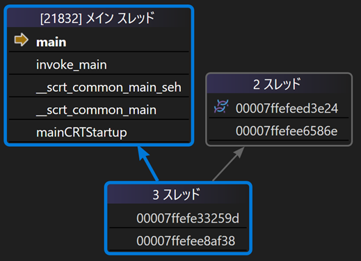

# C++

## C++ とは & 使用用途

- プログラミング言語

- コンパイル言語であり、生成された実行ファイルは CPU 上で直接動作するため高速

- C 言語の超拡張言語。3 年ごとにバージョンアップが行われ、次は C++26 (2026 年)

- 身近なとこで使われています。家電製品、スマートフォン、パソコン、ゲーム機などなど

使用例

- ゲームエンジン (Unreal Engine) <https://www.unrealengine.com/ja/>

- 3D モデリングソフト (Blender) <https://github.com/blender/blender>

- Chromium (Chrome, Edge 等ブラウザの基盤) <https://github.com/chromium/chromium>

- clang (コンパイラ基盤) <https://github.com/llvm/llvm-project>

- V8 JavaScript エンジン <https://github.com/v8/v8>

## Visual Studio の使い方

Visual Studio とは Microsoft 社が提供する統合開発環境 (IDE) です。C++ の開発に特化した機能が豊富で、初心者からプロフェッショナルまで幅広く利用されています。

自動補完機能、デバッグ機能 (変数の中を覗く、ステップ動作) 等が充実しており、初心者でも扱いやすいです。

### 🌟 プロジェクトを作成

Visual Studio を起動

{width=700px}

{width=700px}

保存場所を選択し、プロジェクト名を入力 (ソリューション名は同じで大丈夫)

{width=700px}

!!! note "ソリューションとプロジェクトの関係"

    ソリューション：プロジェクトの集まり

    プロジェクト：ソースコードの集まり

    上記の写真の例では、次のような階層構造ができます。

    ```plaintext
    Desktop/                ← 保存場所
    |
    └─ Test/                ← ソリューションフォルダ
       |
       ├─ Test.sln          ← ソリューションファイル
       └─ Test/             ← プロジェクトフォルダ
          |
          ├─ ...
          └─ main.cpp
    ```

!!! note "ソリューションの開き方"

    ソリューションフォルダに含まれるソリューションファイル (.sln) を開くと、ソリューションが開かれます。

---

### 🌟 実行

再生ボタンを押すと、コンパイルと実行が行われます。


---

### 🌟 ステップ実行

行単位でプログラムを実行し、変数の中身を確認できます。

F10 キーを押すと、ステップ実行モードに入ります。F10 キーを押すたびに、次の行に進みます。F11 キーを押すと、関数の中に入れます。


変数の上にカーソルを合わせると、中身の値を確認できます。

{width=500px}

---

## 入門編

- 🌟 main 関数について

- 🌟 変数

- 🌟 型

- 🌟 配列

- 🌟 配列の要素へのアクセス

- 🌟 標準出力

- 🌟 算術演算、比較演算、論理演算、ビット演算

---

### 🌟main 関数について

C++のプログラムの開始地点で、エントリーポイントとも呼ばれます。｛｝ の中に書いたコードが実行されます。

```cpp
int main()
{
    return 0;
}
```

main 関数の戻り値は実行環境側が受け取ります。

{width=500px}

!!! note "豆知識"

    実はプログラムの起点は main 関数ではありません。

    実行環境を意識せず書けるように、mainから始まると決められているだけです！

    ↓ mainまでの呼び出し履歴　環境：MSVC(Visual Studio)

    {width=400px}

---

### 🌟 変数

値を保持しておく機能です。メモリ上に保存されます。

```cpp
int value = 100;
```

ロボットのプログラムでは多くの変数を使います。例えば、モーターの速度、センサーの値、通信の状態などを保持するために使います。

!!! note "グローバル変数とローカル変数の違い"

    ```cpp
    int global;  // global == 0

    int main()
    {
        int local;  // local == 未定義
    }
    ```

    グローバル変数：0 に初期化される

    ローカル変数：初期化されない(ゴミの値が入ってる) → ローカル変数は必ず初期化！！！

---

### 🌟 型

変数の仕様を決めるもの。

```cpp
int main()
{
    int   i = 3;     // 整数
    float f = 2.1;   // 浮動小数
    bool  b = true;  // 真偽値
    char  c = 'a';   // 文字
}
```

!!! note "auto 型"

    初期化値を見て、コンパイル時に型を推論してくれる機能。

    ```cpp
    auto i = 3;     // i: int
    auto f = 2.1;   // f: double
    auto b = true;  // b: bool
    auto c = 'a';   // c: char
    ```

!!! note "uintx_t, intx_t 型"

    変数にはサイズがあります。これはどの程度メモリを使うかを決めるもので、大きいほど扱える値の範囲が広くなります。

    `int` 型や `long` 型などの型は、実行環境によってサイズが変わります。サイズが変わると扱える値の範囲も変わり、異なる環境間で通信するとき等、バグの素となります。
    
    そこで常にサイズが一定な型が提供されています。一定サイズの型は、符号付きの型と符合無しの型の二種類があります。符号なし整数は負の値を扱えませんが、その分、扱える正の値の範囲が広がります（たとえば、-100〜100 の範囲が 0〜200 になるようなイメージです）。

    | 符号付き整数 | サイズ(byte) |                     扱える値の範囲                     |
    | :----------: | :----------: | :----------------------------------------------------: |
    |    int8_t    |      1       |                       -128 ~ 127                       |
    |   int16_t    |      2       |                    -32,768 ~ 32,767                    |
    |   int32_t    |      4       |             -2,147,483,648 ~ 2,147,483,647             |
    |   int64_t    |      8       | -9,223,372,036,854,775,808 ~ 9,223,372,036,854,775,807 |

    | 符号無し整数 | サイズ(byte) |         扱える値の範囲         |
    | :----------: | :----------: | :----------------------------: |
    |   uint8_t    |      1       |            0 ~ 255             |
    |   uint16_t   |      2       |           0 ~ 65,535           |
    |   uint32_t   |      4       |       0 ~ 4,294,967,295        |
    |   uint64_t   |      8       | 0 ~ 18,446,744,073,709,551,615 |

    一方、扱う値が小さいからといって、必ずしもサイズの小さな型を選ぶのが最適とは限りません。CPUやコンパイラによっては、32ビットや64ビットなど決まったサイズの型を使ったほうが高速になることがあります。これはメモリアライメントに関係しており、変数は特定の境界（たとえば4バイト単位）に揃えて配置されます。小さい型を多用すると、境界を揃えるために余分なメモリ（パディング）が挿入され、効率が下がることもあります。

    そのため、特に理由がない限りは `int` を使うのが一般的です。ライブラリでは複数の環境に対応させる必要があるため、固定長の型を使うことが多いです。

---

### 🌟 配列

配列は同じ型の値を複数保持するための変数の集まりです。サイズは固定で、初期化時に指定します。

```cpp
int array[5] = { 1, 2, 3, 4, 5 };

int array[5] = {};  // ゼロクリア
```

- 変数の集まり

- 🌟 同じ型の値のみ サイズ固定

- 🌟 {} (集成体初期化)によってゼロクリアできる

!!! failure "よくあるゼロクリアのアンチパターン"

    memset を用いたゼロクリア(非効率)

    ※クラスでこれをすると問題になる。仮想関数ポインタを消してしまうため。

    ```cpp
    int array[5];
    memset(array, 0, sizeof array);
    ```

    C言語風 (ダメではない)

    ```cpp
    int array[5] = { 0 };
    ```

---

### 🌟 配列の要素へのアクセス

先頭の要素を読む

```cpp
int head = array[0];
```

末尾の要素に書き込む

※0 番目から始まるので、末尾は(要素数-1)番目となることに注意

```cpp
array[4] = 1234;
```

---

### 🌟 標準出力

```cpp
#include <iostream>

int main()
{
    int value = 1;

    std::cout << value << std::endl;
}
```

{width=400px}

---

### 🌟 算術演算

`+` `-` `*` `/` `%`

剰余算

```cpp
int mod = 100 % 3;  // mod == 1
```

かっこ

```cpp
int result = 2 * (3 + 4);
```

!!! warning "整数同士の除算に注意"

    整数同士の割り算は小数が切り捨てられるため、期待した答えと違う値になります。

    ```cpp
    int result = 3 / 2;   // result == 1 ✖
    ```

    次のように左辺か右辺のどちらかを小数にする必要があります。

    ```cpp
    double result = 3.0 / 2;   // result == 1.5 〇
    ```

    因みに次のように浮動小数点型で結果を受たとしても、右辺が先に評価されるため、割り算の評価に影響せず無意味です。

    ```cpp
    double result = 3 / 2;   // result == 1 ✖
    ```

---

### 🌟 比較演算

主に if 文で使われます。

`==` `!=` `<` `>` `<=` `>=`

```cpp
int value = 1;

if (value == 1)
{
    // ここに入る
}
```

---

### 🌟 論理演算

主に if 文で使われ、複数の条件を判定したい場合に用います。

`&&` `||` `!`

=== "論理演算を使わない場合"

    ``` c
    int a = 1;
    int b = 2;

    if (a == 1)
    {
        if (b == 2)
        {
        }
    }
    ```

=== "論理演算を使う場合"

    ``` c
    int a = 1;
    int b = 2;

    if (a == 1 && b == 2)
    {
    }
    ```

---

### 🌟 ビット演算

`&` `|` `^` `~` `<<` `>>`

各ビットに対して論理演算を行います。

論理演算演算は bool 型同士の演算なのに対し、ビット演算は整数型同士の演算です。

ポートの制御や、バイト列への変換などで使われます。

```cpp
uint8_t a = 0b1010;
uint8_t b = 0b1100;

uint8_t AND = a & b;  // AND == 0b1000
uint8_t OR  = a | b;  // OR  == 0b1110
uint8_t XOR = a ^ b;  // XOR == 0b0110
uint8_t NOT = ~a;     // NOT == 0b0101
uint8_t LSH = a << 1; // LSH == 0b10100
uint8_t RSH = a >> 1; // RSH == 0b0101
```

演算は筆算を思い出すとわかりやすいです。

```plaintext
  1010       1010       1010
& 1100     | 1100     ^ 1100     ~ 1010
------     ------     ------     ------
  1000       1110       0110       0101
```

シフト演算はビットを左右にずらす演算です。変数の表現範囲からはみ出たビットは捨てられます。

```plaintext
<< 2  1010      >> 2  1010
----------      ----------
↓   1010                1010
----------      ----------
    101000            0010
```

---

## 初級編 (制御構文)

- 🌟 if 文
- 🌟 while 文
- 🌟 for 文
- 🌟 参照型
- 🌟 範囲 for 文
- 🌟 break 文
- 🌟 continue 文
- 🌟 switch 文
- 🌟 enum class

---

### 🌟 if 文

条件分岐をする機能。

```cpp
int value = 1;

if (value == 1)
{
    // value が 1 の場合
}
else
{
    // value が 1 以外の場合
}
```

if 文自体が条件式を評価するため、比較演算を使わない if 文も書けます。

```cpp
int value = 1;

if (value)
{
    // value が 0 以外の場合
}
else
{
    // value が 0 の場合
}
```

else if 文を使うことで、条件を次々絞っていくように判定できます。

```cpp
int value = 1;

if (value == 1)
{
    // value が 1 の場合
}
else if (value < 10)
{
    // value が 1 でなく、value が 10 未満の場合
}
```

!!! note

    他の言語には `elif` のような構文がありますが、C、C++ にはありません。

    実は else if 文というものは存在せず、`else` と `if` 文を組み合わせてあるように見せているだけです。

    ```cpp
    int value = 1;

    if (value == 1)
    {
        // value が 1 の場合
    }
    else
        if (value < 10)
        {
            // value が 10 未満の場合 (1は含まない)
        }
    ```

!!! tip "if 文のネストを深くしないコツ"

    実際のプログラムでは、条件分岐が複雑になり、ネストが深くなりがちです。

    論理演算を組み合わせる方法もありますが、早期リターンを使うと複雑な処理の場合にも対応できます。

    早期リターンは条件に合わない場合を先に処理し、条件に合う場合の処理を後に書く方法です。

    === "ネストが深い例"

        ```cpp
        int main()
        {
            int left = 0;
            if (std::cin >> left)
            {
                int right = 0;
                if (std::cin >> right)
                {
                    if (right)
                    {
                        std::cout << left / right << std::endl;
                    }
                    else
                    {
                        std::cout << "[ERROR] right is zero" << std::endl;
                    }
                }
                else
                {
                    std::cout << "[ERROR] invalid right" << std::endl;
                }
            }
            else
            {
                std::cout << "[ERROR] invalid left" << std::endl;
            }
        }
        ```

    === "早期リターンを使った場合"

        ```cpp
        int main()
        {
            int left = 0;
            if (!(std::cin >> left))
            {
                std::cout << "[ERROR] invalid left" << std::endl;
                return 1;
            }

            int right = 0;
            if (!(std::cin >> right))
            {
                std::cout << "[ERROR] invalid right" << std::endl;
                return 1;
            }

            if (right == 0)
            {
                std::cout << "[ERROR] right is zero" << std::endl;
            }

            std::cout << left / right << std::endl;
        }
        ```

---

### 🌟 while 文

繰り返し処理をする機能です。

```cpp
while (true)
{
    // 無限ループ
}
```

ロボコンでは通信の受信処理に使うことが多いです。

```cpp
while (データが残っている())
{
    データを取り出して処理する();
}
```

!!! note "while 文でやりがちなバグ"

    ループ毎にカウントアップするようなプログラムの場合、カウントアップのタイミングを間違えると値の変化が予期しないものになります。

    次に紹介する for 文を使うことでこのようなバグを防げます。

    <div class="grid" markdown>

    ```cpp title="先にカウントアップする場合"
    int i = 0;

    while (i < 3)
    {
        i++;
        std::cout << i << std::endl;
    }

    // 1
    // 2
    // 3
    ```

    ```cpp title="後にカウントアップする場合"
    int i = 0;

    while (i < 3)
    {
        std::cout << i << std::endl;
        i++;
    }

    // 0
    // 1
    // 2
    ```

    </div>

---

### 🌟 for 文

繰り返し処理をする機能です。主に配列を操作する際に使われます。

構文や動作が少々複雑ですが、カウンタ i の値の変化の仕方が分かれば大丈夫です。

```cpp
for (int i = 0; i < 3; i++)
{
    std::cout << i << std::endl;
}
```

```plaintext
0
1
2
```

!!! note "i は次のように変化します。"

    ```plaintext
    {
        i == 0
    }
    ```

    ↓

    ```plaintext
    {
        i == 1
    }
    ```

    ↓

    ```plaintext
    {
        i == 2
    }
    ```

配列の全要素にアクセスする場合、次のように書けます。

```cpp
int array[3] = { 10 , 20, 30 };

for (int i = 0; i < 3; i++)
{
    std::cout << array[i] << std::endl;
}
```

```plaintext
10
20
30
```

クイズ

=== "ソースコード"

    ```cpp
    int array[3] = {};

    for (int i = 0; i < 3; i++)
    {
        array[i] = i * 10;
    }

    for (int i = 0; i < 3; i++)
    {
        std::cout << array[i] << std::endl;
    }
    ```

=== "結果"

    ```plaintext
    0
    10
    20
    ```

---

### 🌟 参照型

次の範囲 for 文で参照を使うので、ここで紹介します。

参照は変数に別名をつける機能です。参照型の変数の値を変更すると、参照先の変数の値も変わります。

```cpp hl_lines="3"
int value = 100;

int& ref = value;

ref = 200;  // value == 200
```

配列の要素に対しても同じく参照を使うことができます。

```cpp
int array[3] = { 10 , 20, 30 };

int& headRef = array[0];

headRef = 0;  // array[0] == 0
```

---

### 🌟 範囲 for 文

通常の for 文の進化系で、配列の全要素に簡単にアクセス出来ます。

```cpp
int array[3] = { 10 , 20, 30 };

for (int value : array)
{
    std::cout << value << std::endl;
}
```

```plaintext
10
20
30
```

範囲 for 文は配列の要素をコピーして取り出すため、このままでは配列の要素を書き換えることはできません。

```cpp
int array[3] = { 10 , 20, 30 };

for (int value : array)
{
    value = 0;
}

for (int value : array)
{
    std::cout << value << std::endl;
}
```

```plaintext
10
20
30
```

参照を使うと配列の要素を書き換えられます。

```cpp hl_lines="3"
int array[3] = { 10 , 20, 30 };

for (int& value : array)
{
    value = 0;
}

for (int value : array)
{
    std::cout << value << std::endl;
}
```

```plaintext
0
0
0
```

!!! note "通常 for 文と範囲 for 文の使い分け"

    範囲 for 文は配列の全要素に同じような処理をする場合に使います。

    通常の for 文とは違い、カウントアップする変数がないため、二つの配列を同時に処理することができません。このような場合は通常の for 文を使います。

    ```cpp
    int array1[3] = { 10 , 20, 30 };
    int array2[3] = { 100 , 200, 300 };

    int results[3] = {};

    for (int i = 0; i < 3; i++)
    {
        results[i] = array1[i] + array2[i];
    }
    ```

!!! note "範囲 for 文の正体"

    範囲 for 文は実は通常の for 文の糖衣構文です。

    ※ 糖衣構文：プログラムを楽に書けるように、本質的な部分を隠蔽した構文

    ```cpp
    int array[3] = { 10 , 20, 30 };

    for (int value : array)
    {
        std::cout << value << std::endl;
    }
    ```

    ↓ 変換後のイメージ

    ```cpp
    int array[3] = { 10 , 20, 30 };

    for (int i = 0; i < 3; i++)
    {
        int value = array[i];
        std::cout << value << std::endl;
    }
    ```

    > ※実際は次のようにイテレーターを使ったコードに変換されます。
    >
    > ```cpp
    > int array[3] = { 10 , 20, 30 };
    >
    > auto&& __range = array;
    > for (auto __begin = std::begin(__range), __end = std::end(__range); __begin != __end; ++__begin)
    > {
    >     int value = *__begin;
    >     std::cout << value << std::endl;
    > }
    > ```

---

### 🌟 break 文

繰り返し処理を途中で終了したい場合に使います。

```cpp
int array[3] = { 10 , 20, 30, 40, 50 };

for (int value : array)
{
    if (value == 40)
    {
        break;
    }

    std::cout << value << std::endl;
}
```

```plaintext
10
20
30
```

---

### 🌟 continue 文

繰り返し処理をスキップしたい場合に使います。

```cpp
int array[3] = { 10 , 20, 30, 40, 50 };

for (int value : array)
{
    if (value == 40)
    {
        continue;  // 次のループへ
    }

    std::cout << value << std::endl;
}
```

```plaintext
10
20
30
50  // 40 がスキップされている
```

---

### 🌟 switch 文

条件分岐をする機能です。if 文に似ていますが、条件が整数型のみです。モード切替や、状態遷移(自動制御)に使われます。

```cpp
int mode = 1;

switch (mode)
{
case 0:
    // mode が 0 の場合
    break;

case 1:
    // mode が 1 の場合
    break;

default:
    // mode が 0 でも 1 でもない場合
    break;
}
```

!!! note "break 忘れに注意"

    break を書かないと、次の case に進んでしまいます。

    ```cpp
    int mode = 1;

    switch (mode)
    {
    case 0:
        // mode が 0 の場合

    case 1:
        // mode が 0 か 1 の場合 (case 0 に break がないため 0 の場合も実行される)
        break;

    default:
        // mode が 0 でも 1 でもない場合
        break;
    }
    ```

---

### 🌟 enum class

列挙型と呼ばれ、値に名前をつける機能です。switch 文と組み合わせて使うことが多いです。値に名前をつけることで、プログラムの可読性が向上します。

※ enum class と class は別物です。

```cpp
enum class Mode
{
    Start,
    PickFruit,
    GotoNext,
};

int main()
{
    Mode mode = Mode::PickFruit;

    switch (mode)
    {
    case Mode::Start:
        // mode が Start の場合
        break;

    case Mode::Mode1:
        // mode が Mode1 の場合
        break;

    case Mode::GotoNext:
        // mode が GotoNext の場合
        break;
    }
}
```

---

## 中級編

- 🌟 関数
- 🌟 構造体 ！超大事！
- 🌟 クラス
- 🌟 名前空間
- 🌟 インクルード
- 🌟 マクロ
- 🌟 プリプロセス時条件分岐

### 🌟 関数

処理をまとめて名前をつける機能です。同じ処理を何度も書いている場合、関数にまとめることでコードの重複を減らすことができます。

かっこ `()` の中は引数と呼ばれ、関数に渡す値を指定します。

処理結果は戻り値と呼ばれ、`return` で返します。

```cpp
int add(int a, int b)
{
    return a + b;
}

int main()
{
    int result = add(1, 2);  // result == 3
}
```

戻り値が少しややこしいですが、計算の順番を意識すると理解しやすいです。

規格で初期化子 (=) の右辺が先に計算されると決まっているので、次のように計算されます。

```cpp
int result = add(1, 2);

// ↓
// add関数に 1, 2 を渡し、戻り値 3 を得る
// ↓

int result = 3;
```

!!! note "複数の値を戻り値にしたい場合"

    ※今は分からなくても大丈夫です。

    関数は一つの値しか返すことができません。複数の値を返したい場合は構造体を使って一つの値にまとめるか、参照を使うことで実現できます。

    C++ では構造体を使うことが多いです。参照型の方が理解しやすいですが、関数は処理が一方向になるような設計が望ましいため、参照型は避けることが多いです。

    === "参照型"

        ```cpp
        void divide(int a, int b, int& result, bool& success)
        {
            if (b == 0)
            {
                success = false;
                return;
            }

            result = a / b;
            success = true;
        }

        int main()
        {
            int result = 0;
            bool success = false;
            divide(10, 2, result, success);

            if (success)
            {
                std::cout << result << std::endl;
            }
            else
            {
                std::cout << "divide by zero" << std::endl;
            }
        }
        ```

    === "構造体"

        ```cpp
        struct Result
        {
            int value;
            bool success;
        };

        Result divide(int a, int b)
        {
            if (b == 0)
            {
                return { 0, false };
            }

            return { a / b, true };
        }

        int main()
        {
            Result result = divide(10, 2);

            if (result.success)
            {
                std::cout << result.value << std::endl;
            }
            else
            {
                std::cout << "divide by zero" << std::endl;
            }
        }
        ```

---

### 🌟 構造体

変数をグループ化する機能です。座標や、ピン番号など、関連する変数をまとめるときに使います。

型を自分で作る機能とも言えます。(ユーザー定義型)

変数名を単純にできるなど、デカすぎるメリットが数多くあります。構造体を進化させるとクラスになります。

<div class="grid" markdown>

```cpp title="変数だけの場合"
int main()
{
    int a_x = 10;
    int a_y = 20;

    int b_x = 30;
    int b_y = 40;
}
```

```cpp title="構造体を使った場合"
struct Vec2  // ← 構造体名
{
    int x;  // ← メンバ変数
    int y;
};

int main()
{
    Vec2 a{ 10, 20 };  // ← インスタンス化
    Vec2 b{ 30, 40 };
}
```

</div>

メンバ変数には `.` でアクセスします。

```cpp
int main()
{
    Vec2 a{ 10, 20 };

    std::cout << a.x << ", " << a.y << std::endl;  // 10, 20
}
```

書き換えも変数同様にできます。

```cpp
int main()
{
    Vec2 a{ 10, 20 };

    a.x = 30;

    std::cout << a.x << std::endl;  // 30
}
```

!!! note "std::cout に構造体を渡す"

    ※今は分からなくても大丈夫です。

    構造体の値を出力する際、毎度メンバ変数を指定するのは面倒です。構造体に標準出力への `<<` 演算子をオーバーロードすることで、構造体をそのまま出力できるようになります。

    ```cpp
    struct Vec2
    {
        int x;
        int y;

        friend std::ostream& operator<<(std::ostream& os, const Vec2& vec)
        {
            return os << vec.x << ", " << vec.y;
        }
    };

    int main()
    {
        Vec2 a{ 10, 20 };

        std::cout << a << std::endl;  // 10, 20
    }
    ```

---

### 🌟 クラス

次章で説明します！

---

### 🌟 名前空間

名前空間は変数や関数の名前の衝突を防ぐ機能です。主にライブラリ内で使われます。

:: で名前空間を指定します。`std::cout` の `std` が名前空間です。

```cpp
namespace Robocon
{
    int value = 100;
}

int main()
{
    std::cout << Robocon::value << std::endl;  // 100
}
```

---

### 🌟 インクルード

`#` が頭につく命令はプリプロセッサ命令と呼ばれ、コンパイル前に実行される命令です。主にソースコードの置換を行う機能です。

インクルード文は他のファイルの内容を取り込む機能です。ファイル分割した際や、ライブラリの読み込みに使われます。通常はヘッダーファイル(.h, .hpp)をインクルードします。

<div class="grid" markdown>

```cpp title="置換前" hl_lines="1"
#include <iostream>

int main()
{
    std::cout << "Hello, World!" << std::endl;
}
```

```cpp title="置換後" hl_lines="1-12"
// iostream standard header

// Copyright (c) Microsoft Corporation.
// SPDX-License-Identifier: Apache-2.0

#ifndef _IOSTREAM_
#define _IOSTREAM_

#pragma pack(push, _CRT_PACKING)
#pragma warning(push, _STL_WARNING_LEVEL)
#pragma warning(disable : _STL_DISABLED_WARNINGS)
...

int main()
{
    std::cout << "Hello, World!" << std::endl;
}
```

</div>

!!! note "要らん知識"

    ただの文字列置き換えの為、ヘッダーファイル以外もインクルードできます。

    <div class="grid" markdown>

    ```cpp hl_lines="2"
    int data[] {
        #include "data.txt"
    };
    ```

    ```txt title="data.txt"
    1, 2, 3, 4, 5
    ```

    </div>

    このようにすると、data.txt の内容が data 配列に展開されます。

    ```cpp
    int data[] {
        1, 2, 3, 4, 5
    };
    ```

---

### 🌟 マクロ

主に定数の定義(C 言語のみ)に使われます。

<div class="grid" markdown>

```cpp title="置換前"
#define VALUE 100

int main()
{
    int value = VALUE;
}
```

```cpp title="置換後"
int main()
{
    int value = 100;
}
```

</div>

マクロは定数だけでなく、関数のような使い方もできます。ただ型のチェックがされなかったり、予期しない置換が起こるため、マクロは嫌われています。

<div class="grid" markdown>

```cpp title="置換前"
#define ADD(a, b) ((a) + (b))

int main()
{
    int value = ADD(1, 2);
}
```

```cpp title="置換後"
int main()
{
    int value = ((1) + (2));
}
```

</div>

---

### 🌟 プリプロセス時条件分岐

条件によってソースコードを切り替える機能です。主にデバッグ用のログ出力や、プラットフォームによって処理を変える場合に使われます。

マクロの定義、未定義によって処理を変える場合

<div class="grid" markdown>

```cpp title="置換前"
#define DEBUG

int main()
{
#ifdef DEBUG
    std::cout << "Debug Mode" << std::endl;
#endif
}
```

=== "DEBUG が定義されている"

    ```cpp
    int main()
    {
        std::cout << "Debug Mode" << std::endl;
    }
    ```

=== "DEBUG が未定義"

    ```cpp
    int main()
    {
    }
    ```

</div>

プラットフォームによって処理を変える場合

<div class="grid" markdown>

```cpp title="置換前"
#ifdef _WIN32
#   include <windows.h>
#elif __linux__
#   include <unistd.h>
#endif

int main()
{
#ifdef _WIN32
    Sleep(1000);
#elif __linux__
    sleep(1);
#endif
}
```

=== "置換後 (Windows)"

    ```cpp
    #   include <windows.h>

    int main()
    {
        Sleep(1000);
    }
    ```

=== "置換後 (Linux)"

    ```cpp
    #   include <unistd.h>

    int main()
    {
        sleep(1);
    }
    ```

</div>
