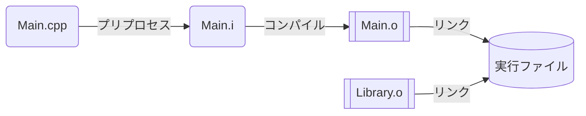
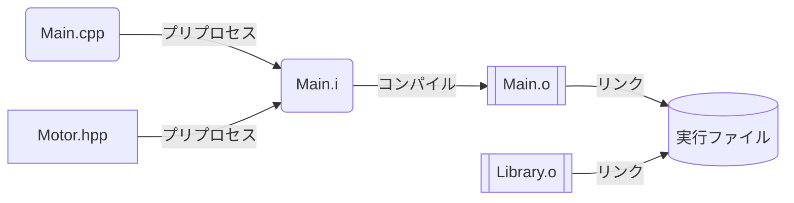
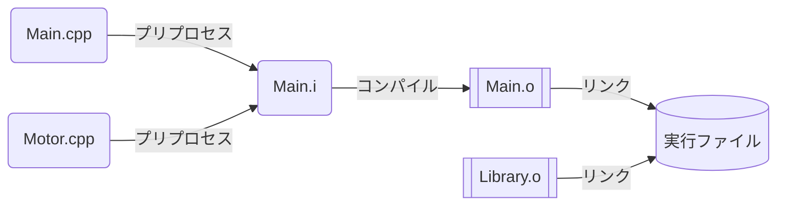
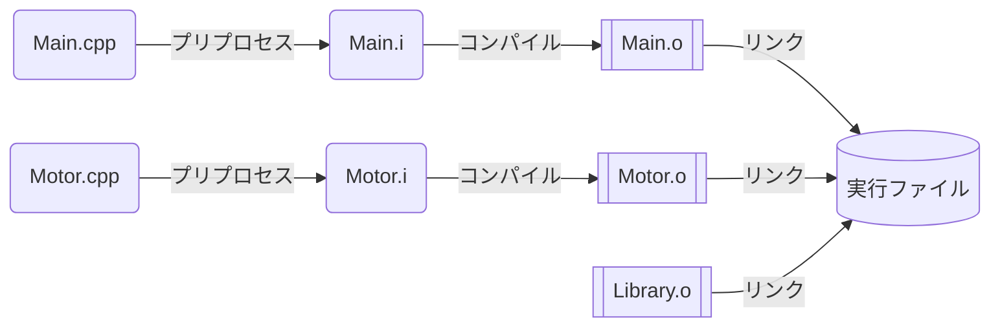
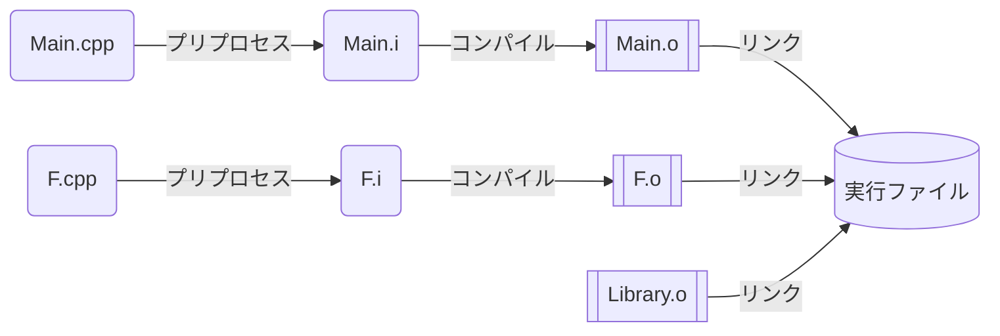

# ファイル分割編

開発が進むとメインのソースファイルが肥大化し、見通しが悪くなります。そこでファイルを分割します。

分割しやすいのはクラスで、定義場所をヘッダーファイルに移動できます。

※一般的にはソースファイルとヘッダーファイルに分割しますが、コンパイル順序を良く理解する必要があります。かなりややこしいため、部ではヘッダーファイルのみに分割しています。

<div class="grid" markdown>

```cpp title="Main.ino"
#include "Motor.hpp"

Motor motor1{ 2, 3, 4 };
Motor motor2{ 5, 6, 7 };

void setup()
{
    motor1.begin();
    motor2.begin();
}

void loop()
{
    motor1.move(-128);
    motor2.move(128);
}
```

```cpp title="Motor.hpp" hl_lines="1"
#pragma once

class Motor
{
    int pinA;
    int pinB;
    int pinP;

public:

    Motor(int pinA, int pinB, int pinP)
        : pinA(pinA)
        , pinB(pinB)
        , pinP(pinP)
    {
    }

    void begin()
    {
        pinMode(pinA, OUTPUT);
        pinMode(pinB, OUTPUT);
    }

    void move(int power)
    {
        digitalWrite(pinA, (power >= 0) ? HIGH : LOW);
        digitalWrite(pinB, (power <= 0) ? HIGH : LOW);
        analogWrite(pinP, abs(power));
    }
};
```

</div>

### 🌟 インクルードガード

`#pragma once` はインクルードガードと呼ばれるプリプロセッサ命令です。

インクルード文はファイルの内容をコピーするだけなので、複数回インクルードすると多重定義でエラーが発生します。

<div class="grid" markdown>

```cpp title="Main.ino"
#include "Motor.hpp"
#include "Motor.hpp"
```

```cpp title="Motor.hpp"
class Motor
{
};
```

```cpp title="インクルード展開後のMain.ino"
class Motor
{
};

class Motor  // 💀 多重定義エラー
{
};
```

</div>

インクルードガードを使うと、一度インクルードされたファイルは再度展開されません。

<div class="grid" markdown>

```cpp title="Main.ino"
#include "Motor.hpp"
#include "Motor.hpp"
```

```cpp title="Motor.hpp"
#pragma once

class Motor
{
};
```

```cpp title="インクルード展開後のMain.ino"
class Motor
{
};

// スルー
```

</div>

マクロを使って実装されることもあります。C 言語では主流ですが、C++ でも使います。`#pragma once` が標準化されていないためです(事実上の標準というやつです)。

<div class="grid" markdown>

```cpp title="Motor.hpp"
#ifndef MOTOR_HPP
#define MOTOR_HPP

class Motor
{
};

#endif
```

```cpp title="インクルード展開後のMain.ino"
#ifndef MOTOR_HPP
#define MOTOR_HPP

class Motor
{
};

#endif

#ifndef MOTOR_HPP
// MOTOR_HPP は既に定義されているので以降はスルー
#define MOTOR_HPP

class Motor
{
};

#endif
```

```cpp title="プリプロセス後のMain.ino"
class Motor
{
};
```

</div>

### 🌟 ファームウエアのビルド順序

ソースファイルは次のように実行ファイルへと変換されます。この工程はビルドとも呼ばれます。



!!! note "拡張子"

    - `.cpp` : ソースファイル
    - `.hpp` : ヘッダーファイル
    - `.i` : プリプロセス後のファイル (ほぼソースファイル)
    - `.o` : オブジェクトファイル
    - `.exe` : 実行ファイル (Windows)

#### ヘッダーファイルがある場合

ヘッダーファイルをインクルードしている場合、次のようになります。プリプロセスはただの結合なのでわかりやすいと思います。



#### 複数のソースファイルがある場合

この場合どのようにコンパイルされるでしょうか？次のように結合されてからコンパイルされそうですよね。



実はソースファイルは別々にコンパイルされ、最後に結合されます。



このような順序にすることで、変更していないソースファイルを再度コンパイルする必要がなくなり、ビルド時間の短縮につながります。

しかしこれに起因した複雑怪奇なエラーが発生することもあります 🤢🤢

### 🌟 ヘッダーファイルに関数を定義してはいけない理由

実はヘッダーファイルには関数を定義してはいけません。

一旦 Motor クラスは忘れて、関数をヘッダーファイルに定義し、インクルードしたとします。しっかりインクルードガードもしてます。

実はエラーが隠れていますが、この場合エラーになりません。

<div class="grid" markdown>

```cpp title="Main.ino"
#include "Division.hpp"

int main()
{
    double result = divide(10, 2);
}
```

```cpp title="Division.hpp"
#pragma once

double divide(double a, double b)
{
    return a / b;
}
```

</div>

複数のソースファイルからインクルードすると、リンクエラーが発生します。

<div class="grid" markdown>

```cpp title="Main.ino"
#include "Division.hpp"
// 以下略
```

```cpp title="F.cpp"
#include "Division.hpp"
// 以下略
```

</div>

```plaintext
1>ソース.obj : error LNK2005: "double __cdecl divide(double,double)" (?divide@@YANNN@Z) は既に Main.obj で定義されています。
1>C:\Users\xxxxxxxxxx\Main.exe : fatal error LNK1169: 1 つ以上の複数回定義されているシンボルが見つかりました。
1>プロジェクト "Main.vcxproj" のビルドが終了しました -- 失敗。
```

#### エラー原因

ソースファイルは別々にコンパイルされるため、インクルードガードを突破して関数が複数定義され、リンクエラーとなります。



プリプロセス後のファイルは次のようになります。

<div class="grid" markdown>

```cpp title="Main.i"
double divide(double a, double b)
{
    return a / b;
}

// 以下略
```

```cpp title="F.i"
double divide(double a, double b)
{
    return a / b;
}

// 以下略
```

</div>

コンパイル後のオブジェクトファイルのイメージです。実際はバイナリデータです。

<div class="grid" markdown>

```cpp title="Main.o"
divide(double, double):
    ret a / b
```

```cpp title="F.o"
divide(double, double):
    ret a / b
```

</div>

リンクの際、同じ名前の関数が複数あるためリンクエラーが発生します。

#### 対応策 / インライン化

インライン関数として定義することで、ヘッダーファイルに関数を定義してもリンクエラーが発生しません。

インライン関数は複数のソースファイルで登場しても関数の実体は一つとできるためです。

```cpp title="Division.hpp"
#pragma once

inline double divide(double a, double b)
{
    return a / b;
}
```

#### 対応策 / ソースファイルに定義

ヘッダーファイルに関数の宣言だけ書いておき、ソースファイルに関数の定義を書く方法もあります。

こちらが一般的ですが、インライン化の方が楽です。C 言語の場合は必ずこの方法を使います。

```cpp title="Division.hpp"
#pragma once

double divide(double a, double b);
```

```cpp title="Division.cpp"
#include "Division.hpp"

double divide(double a, double b)
{
    return a / b;
}
```

### 🌟 クラスは？

クラスはヘッダーファイルに定義してもリンクエラーが発生しません。実はクラスのメンバ関数は暗黙の内にインライン化されているためです。

### 🌟 まとめ

- クラスはヘッダーファイルに分割する
- インクルードガードを使う
- ヘッダーファイルに関数を定義する際はインライン化する
- クラスのメンバ関数はインライン化されるため何もしなくて OK
