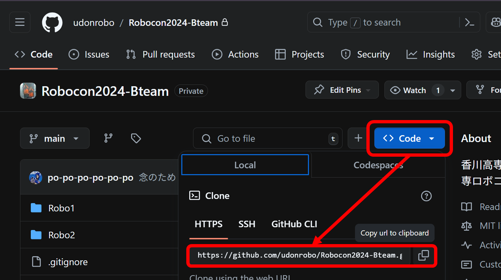

# Git / GitHub

## Git について

<https://git-scm.com/>

バージョン管理ツール

変更履歴を管理してくれるので、ミスった際に戻したりできます 👍

複数人で開発できる仕組みになっています。

!!! note "ありがちな勘違い"

    ✖ 変更を監視するソフトウエアが常に動いていて、変更を記録している

    〇 変更を登録するコマンドを打ったタイミングで変更が記録される

## GitHub について

<https://github.com>

Git + クラウドサービス

オープンソースのソフトウエアは大体 GitHub で公開されてます。

プログラマーは大抵使っており、企業も使ってます。便利過ぎてお金を払いたくなるレベルです。

## レポジトリ

変更履歴等を格納しているデータベース

実体は単なるフォルダ (`.git`フォルダを含む)

!!! note "規模感"

    1 プロジェクトにつき 1 レポジトリ

    例) Robocon2024-Bteam, Harurobo2024-Ateam, Homepage, ...

## どうやって使う？

コマンドを使ってダウンロードしたりアップロードしたりします。

VSCode の拡張機能を使うとかなり簡単に扱えますが、Git の内部動作を理解するためにもまずはコマンドから入ります。

最低限覚えるコマンド

- git clone
- git add
- git commit
- git push
- git pull

## 早速 GitHub からレポジトリをダウンロード (クローン)

URL を基にクローンします。

```sh
git clone <URL>
```



## 変更を登録 (コミット)

プログラムの変更や追加が終わったらコミットを作成します。コミットとはチェックポイントのようなものです。

プログラムを破壊した場合でも、コミットがあればその時の状態に復元できます。

コマンドはクローンしたレポジトリのディレクトリで実行する必要があります。

```sh
git add .
git commit -m "<コミットメッセージ>"
```

!!! note "git add とは"

    変更したファイルのうち、どのファイルをコミットするか選択するためのコマンドです。

    `.` はコマンド実行時にいるディレクトリを表すので、`git add .` は全ての変更をコミット対象にするという意味になります。

    大量にファイルを変更した場合、まとめてコミットしてしまうと、どのような変更をしたのか分かりにくくなるので、分けてコミットします。

## 変更をアップロード (プッシュ)

正常にプッシュできている場合、GitHub を覗くと変更が反映されていることが確認できます。

```sh
git push
```

## 変更をダウンロード (プル)

他の人が GitHub にプッシュした場合、その変更を取り込む必要があります。

push とは対の関係にあります。

```sh
git pull
```

!!! not annotate "クローンとの違い"

    clone: 無の状態からレポジトリをダウンロード

    pull: 既にあるレポジトリに変更を取り込む

## 実際の Git の使われ方

1. レポジトリ作成、制御班全員でクローン
2. 部活始まり：とりあえずプル
3. 部活中：開発 → コミット → 開発 → コミット → ...
4. 部活終了：プッシュ

他の制御班の開発したコードをすぐ反映したい場合は、プッシュしてもらう。

## 変更が衝突した場合どうするか (コンフリクト解消)

Git は行単位で変更を管理します。そのため同じ行を複数人が編集しなければ上手く変更を合成してくれます。

しかし同じ行を編集してしまうと、プルの際にコンフリクト(変更の衝突)が発生します。

```sh
git pull

Auto-merging main.cpp
CONFLICT (content): Merge conflict in main.cpp
Automatic merge failed; fix conflicts and then commit the result.
```

コンフリクトが発生した箇所に衝突を知らせる文字列が書き込まれます。

```cpp
<<<<<< HEAD
#include <iostream> b
=======
#include <iostream>a
>>>>>> 0ee56ac7244877a690d9df3b8ff51be7fecb6b94

int main()
{
}
```

残したい方を残し、手動で文字列を削除します。

```cpp
#include <iostream> b

int main()
{
}
```

もう一度コミットしプッシュすれば解消です。

```sh
git add .
git commit -m "コンフリクト解消"
git push
```
