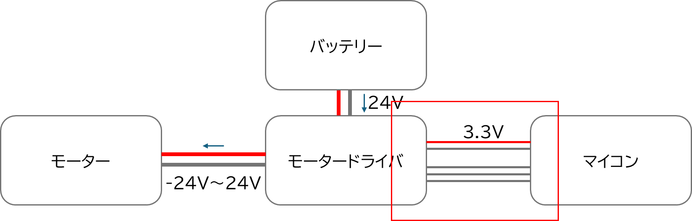
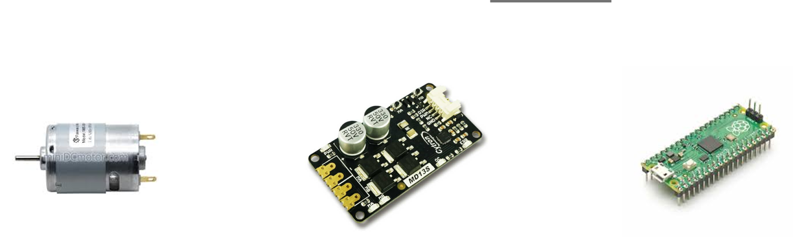
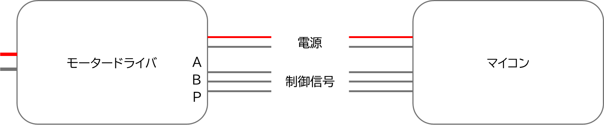

# モーター回しましょ

## Arduino IDE について

マイコンのプログラムを開発するソフトウエアです。<https://www.arduino.cc/en/software>


主に Arduino マイコンの開発に用いますが、Arduino 以外のマイコンもこのソフトウエアで開発できます。

## Arduino 最短コード

Arduino で最短のプログラムは以下の通りです。C++ で記述し、setup 関数と loop 関数が必要です。

```cpp
void setup()
{
}

void loop()
{
}
```

setup 関数は：マイコンが起動したときに一度だけ実行されます。初期化処理はここに書きます。

loop 関数：マイコンが起動してから終了するまで繰り返し実行されます。メインの処理はここに書きます。

※マイコンは電源を入れると即起動します。

!!! note "main 関数は？"

    C++ は main 関数がプログラムの起点ですが、Arduino環境 では main 関数を定義しません。main 関数は Arduino の内部で定義されています。

    ```cpp title="隠蔽された main 関数"
    int main()
    {
        setup();

        for (;;)
        {
            loop();
        }
    }
    ```

    実装 : <https://github.com/arduino/ArduinoCore-avr/blob/master/cores/arduino/main.cpp>

## Arduino の関数やライブラリの調べ先

Arduino 日本語リファレンス <http://www.musashinodenpa.com/arduino/ref/>

Arduino Reference (英語) <https://docs.arduino.cc/language-reference/>

garretlab (ブログ) <https://garretlab.web.fc2.com/arduino.cc/www/reference/ja/language/>

## 入出力ピンの制御

マイコンの各ピンからは電圧を出力したり、電圧を読み取ることができます。

### 🌟 出力してみる (digitalWrite 関数)

HIGH または LOW を、指定したピンに出力します。

マイコンによりますが、HIGH は 3.3V または 5V、LOW は 0V に対応します。

<div class="grid" markdown>

```cpp title="ピンに電圧をHIGHに"
digitalWrite(出力したいピン, HIGH);
```

```cpp title="ピンの電圧をLOWに"
digitalWrite(出力したいピン, LOW);
```

</div>

{width="700px"}

25 番ピンは Raspberry Pi Pico に表面実装されている LED に接続されているため、このピンの電圧を変化させて LED を点灯させてみましょう。

```cpp
void setup()
{
    pinMode(25, OUTPUT); // 25番ピンを出力に設定
}

void loop()
{
    digitalWrite(25, HIGH); // 25番ピンに電圧を出力
    delay(1000);            // 1秒待つ
    digitalWrite(25, LOW);  // 25番ピンの電圧を切る
    delay(1000);            // 1秒待つ
}
```

delay 関数は指定した時間だけ処理を停止します。引数はミリ秒です。

```cpp
delay(1000);  // 1秒待つ
```

### 🌟 アナログ出力 (analogWrite 関数)

指定したピンに PWM 信号を出力します。

PWM は HIGH, LOW を高速で切り替える事で擬似的にアナログ出力 (好きな電圧) を実現します。

```cpp
analogWrite(出力したいピン, 出力値);
```

### モーターを回す際の回路構成

マイコンのピンは出力電流、電圧的にモーターを直接駆動できません。そこでモータードライバを介してモーターを駆動します。

↓ モーターを動かす際の構成図





## プログラムでモーターを回す

### 🌟 モータードライバとマイコンの接続

モーターを回す際に必要な情報は、回転方向と出力値です。この情報をマイコンからモータードライバに送ります。

一般的には以下のように A, B 線にディジタル電圧で方向を、P 線にアナログ電圧で出力値を送ります。



A, B 線の電圧値とモーターの回転方向は以下のように対応します。

| A    | B    | 回転方向 |
| ---- | ---- | -------- |
| HIGH | LOW  | 正転     |
| LOW  | HIGH | 逆転     |
| HIGH | HIGH | ブレーキ |

例えば逆転で 50% の出力値を送る場合、次のように記述します。ピン番号は定数で定義しておくと変更しやすくなります。

```cpp
const int pinA = 2; // A 線のピン番号
const int pinB = 3; // B 線のピン番号
const int pinP = 4; // P 線のピン番号

void setup()
{
    pinMode(pinA, OUTPUT);
    pinMode(pinB, OUTPUT);
}

void loop()
{
    digitalWrite(pinA, LOW);
    digitalWrite(pinB, HIGH);
    analogWrite(pinP, 128);
}
```

### 🌟 出力値の指定を自動化する

HIGH, LOW 等を直接記述するのはわかりにくいため、変数の正負から HIGH, LOW を自動で切り替えられるように変更します。

```cpp
void loop()
{
    int power = -128; // 出力値

    if (power == 0)
    {
        digitalWrite(pinA, HIGH);
        digitalWrite(pinB, HIGH);
    }
    else if (power > 0)
    {
        digitalWrite(pinA, HIGH);
        digitalWrite(pinB, LOW);
    }
    else
    {
        digitalWrite(pinA, LOW);
        digitalWrite(pinB, HIGH);
    }

    analogWrite(pinP, abs(power));  // abs は絶対値を返す関数
}
```

三項演算子を用いると短く書けます。

```cpp
void loop()
{
    int power = -128; // 出力値

    digitalWrite(pinA, (power >= 0) ? HIGH : LOW);
    digitalWrite(pinB, (power <= 0) ? HIGH : LOW);
    analogWrite(pinP, abs(power));  // abs は絶対値を返す関数
}
```

!!! note "三項演算子"

    三項演算子は if 文の様な条件分岐を一行で記述することができます。

    ```cpp
    条件 ? 真の場合の値 : 偽の場合の値
    ```

    例えば、最大値を求めたい場合以下のように記述できます。

    ```cpp
    int a = 1;
    int b = 2;

    int max = (a > b) ? a : b;  // max には 2 が代入される
    ```

### 🌟 複数のモーターに対応させよう

複数のモーターを制御する場合同じような処理が何度も登場するため、関数化してスッキリさせましょう。

=== "関数化前"

    ```cpp
    const int motor1PinA = 2;
    const int motor1PinB = 3;
    const int motor1PinP = 4;

    const int motor2PinA = 5;
    const int motor2PinB = 6;
    const int motor2PinP = 7;

    void setup()
    {
        pinMode(motor1PinA, OUTPUT);
        pinMode(motor1PinB, OUTPUT);

        pinMode(motor2PinA, OUTPUT);
        pinMode(motor2PinB, OUTPUT);
    }

    void loop()
    {
        int power1 = -128;
        int power2 = 128;

        digitalWrite(motor1PinA, (power1 >= 0) ? HIGH : LOW);
        digitalWrite(motor1PinB, (power1 <= 0) ? HIGH : LOW);
        analogWrite(motor1PinP, abs(power1));

        digitalWrite(motor2PinA, (power2 >= 0) ? HIGH : LOW);
        digitalWrite(motor2PinB, (power2 <= 0) ? HIGH : LOW);
        analogWrite(motor2PinP, abs(power2));
    }
    ```

=== "関数化後"

    ```cpp hl_lines="9-13 15-20 24 25 30 31"
    const int motor1PinA = 2;
    const int motor1PinB = 3;
    const int motor1PinP = 4;

    const int motor2PinA = 5;
    const int motor2PinB = 6;
    const int motor2PinP = 7;

    void motorBegin(int pinA, int pinB)
    {
        pinMode(pinA, OUTPUT);
        pinMode(pinB, OUTPUT);
    }

    void motorMove(int pinA, int pinB, int pinP, int power)
    {
        digitalWrite(pinA, (power >= 0) ? HIGH : LOW);
        digitalWrite(pinB, (power <= 0) ? HIGH : LOW);
        analogWrite(pinP, abs(power));
    }

    void setup()
    {
        motorBegin(motor1PinA, motor1PinB);
        motorBegin(motor2PinA, motor2PinB);
    }

    void loop()
    {
        motorMove(motor1PinA, motor1PinB, motor1PinP, -128);
        motorMove(motor2PinA, motor2PinB, motor2PinP, 128);
    }
    ```

### 🌟 構造体を使って変数をグループ化させよう

モーターごとに変数をグループ化させることで変数の管理が楽になります。

変数名もすっきりしてとても見やすくなります。

<div class="grid" markdown>

```cpp title="構造体を使わない場合"
const int motor1PinA = 2;
const int motor1PinB = 3;
const int motor1PinP = 4;

const int motor2PinA = 5;
const int motor2PinB = 6;
const int motor2PinP = 7;

const int motor3PinA = 8;
const int motor3PinB = 9;
const int motor3PinP = 10;
```

```cpp title="構造体を使った場合"
struct Motor
{
    int pinA;
    int pinB;
    int pinP;
};

Motor motor1{ 2, 3, 4 };
Motor motor2{ 5, 6, 7 };
Motor motor3{ 8, 9, 10 };
```

</div>

構造体を関数に渡せるように変更します。

!!! note "構造体を関数に渡す"

    C++ では引数に渡されたインスタンスはコピーされます。組み込み型 (int, float 等) はコピーされても問題ありませんが、構造体は大きなデータを持つことがあるため処理速度に影響します。

    そこで参照渡しを用います。普通の参照を使うと呼び出し元の変数の値を変更できてしまうため、 const を付けて変更できないようにします。

    <div class="grid" markdown>

    ```cpp title="コピー渡し"
    void motorBegin(Motor motor)
    {
        pinMode(motor.pinA, OUTPUT);
        pinMode(motor.pinB, OUTPUT);
    }
    ```

    ```cpp title="参照渡し" hl_lines="1"
    void motorBegin(const Motor& motor)
    {
        pinMode(motor.pinA, OUTPUT);
        pinMode(motor.pinB, OUTPUT);
    }
    ```

    </div>

```cpp hl_lines="8 14 26 27 32 33"
struct Motor
{
    int pinA;
    int pinB;
    int pinP;
};

void motorBegin(const Motor& motor)
{
    pinMode(motor.pinA, OUTPUT);
    pinMode(motor.pinB, OUTPUT);
}

void motorMove(const Motor& motor, int power)
{
    digitalWrite(motor.pinA, (power >= 0) ? HIGH : LOW);
    digitalWrite(motor.pinB, (power <= 0) ? HIGH : LOW);
    analogWrite(motor.pinP, abs(power));
}

Motor motor1{ 2, 3, 4 };
Motor motor2{ 5, 6, 7 };

void setup()
{
    motorBegin(motor1);
    motorBegin(motor2);
}

void loop()
{
    motorMove(motor1, -128);
    motorMove(motor2, 128);
}
```

### 🌟 構造体と関数からクラスへ

構造体と関数を合体させるとクラスになります。

<div class="grid" markdown>

```cpp title="構造体と関数"
struct Motor
{
    int pinA;
    int pinB;
    int pinP;
};

void motorBegin(const Motor& motor)
{
    pinMode(motor.pinA, OUTPUT);
    pinMode(motor.pinB, OUTPUT);
}

void motorMove(const Motor& motor, int power)
{
    digitalWrite(motor.pinA, (power >= 0) ? HIGH : LOW);
    digitalWrite(motor.pinB, (power <= 0) ? HIGH : LOW);
    analogWrite(motor.pinP, abs(power));
}

Motor motor1{ 2, 3, 4 };
Motor motor2{ 5, 6, 7 };

void setup()
{
    motorBegin(motor1);
    motorBegin(motor2);
}

void loop()
{
    motorMove(motor1, -128);
    motorMove(motor2, 128);
}
```

```cpp title="クラス"
class Motor
{
    int pinA;
    int pinB;
    int pinP;

    void begin()
    {
        pinMode(pinA, OUTPUT);
        pinMode(pinB, OUTPUT);
    }

    void move(int power)
    {
        digitalWrite(pinA, (power >= 0) ? HIGH : LOW);
        digitalWrite(pinB, (power <= 0) ? HIGH : LOW);
        analogWrite(pinP, abs(power));
    }
};

Motor motor1{ 2, 3, 4 };
Motor motor2{ 5, 6, 7 };

void setup()
{
    motor1.begin();
    motor2.begin();
}

void loop()
{
    motor1.move(-128);
    motor2.move(128);
}
```

</div>

## bbbb

### cccc

### aaaaaaa

#### dddd