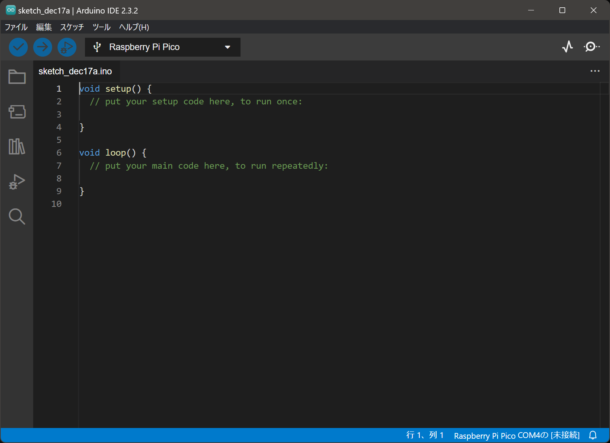
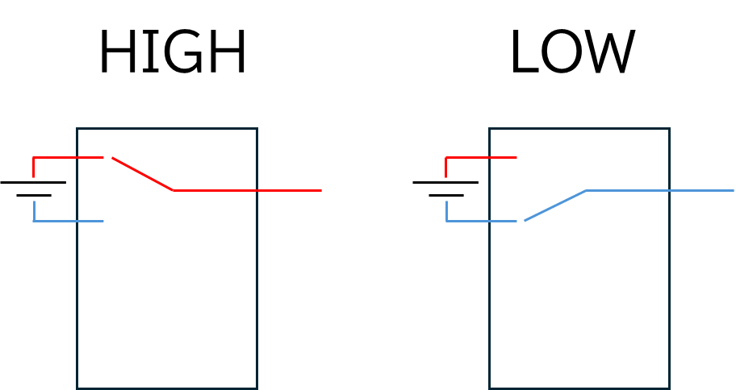

# モーター回しましょ

## Arduino IDE について

マイコンのプログラムを開発するソフトウエアです。<https://www.arduino.cc/en/software>



主に Arduino マイコンの開発に用いますが、Arduino 以外のマイコンもこのソフトウエアで開発できます。

## Arduino 最短コード

Arduino で最短のプログラムは以下の通りです。C++ で記述し、setup 関数と loop 関数が必要です。

```cpp
void setup()
{
}

void loop()
{
}
```

setup 関数は：マイコンが起動したときに一度だけ実行されます。初期化処理はここに書きます。

loop 関数：マイコンが起動してから終了するまで繰り返し実行されます。メインの処理はここに書きます。

※マイコンは電源を入れると即起動します。

!!! note "main 関数は？"

    C++ は main 関数がプログラムの起点ですが、Arduino環境 では main 関数を定義しません。main 関数は Arduino の内部で定義されています。

    ```cpp title="隠蔽された main 関数"
    int main()
    {
        setup();

        for (;;)
        {
            loop();
        }
    }
    ```

    実装 : <https://github.com/arduino/ArduinoCore-avr/blob/master/cores/arduino/main.cpp>

## 入出力ピンの制御

マイコンの各ピンからは電圧を出力したり、電圧を読み取ることができます。

### 出力してみる (digitalWrite)

`digitalWrite` 関数を使って、指定したピンに電圧を出力します。

<div class="grid" markdown>

```cpp title="ピンに電圧を3.3Vに"
digitalWrite(出力したいピン, HIGH);
```

```cpp title="ピンの電圧を0Vに"
digitalWrite(出力したいピン, LOW);
```

</div>

{width="700px"}

25 番ピンは Raspberry Pi Pico に表面実装されている LED に接続されているため、このピンの電圧を変化させて LED を点灯させてみましょう。

```cpp
void setup()
{
    pinMode(25, OUTPUT); // 25番ピンを出力に設定
}

void loop()
{
    digitalWrite(25, HIGH); // 25番ピンに電圧を出力
    delay(1000);            // 1秒待つ
    digitalWrite(25, LOW);  // 25番ピンの電圧を切る
    delay(1000);            // 1秒待つ
}
```

delay 関数は指定した時間だけ処理を停止します。引数はミリ秒です。

```cpp
delay(1000);  // 1秒待つ
```

### アナログ出力 (analogWrite)

`analogWrite` 関数を使って、指定したピンに PWM 信号を出力します。

PWM は HIGH, LOW を高速で切り替える事で擬似的にアナログ出力を実現します。

```cpp
analogWrite(出力したいピン, 出力値);
```
