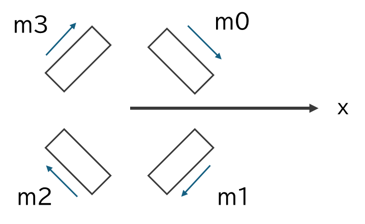
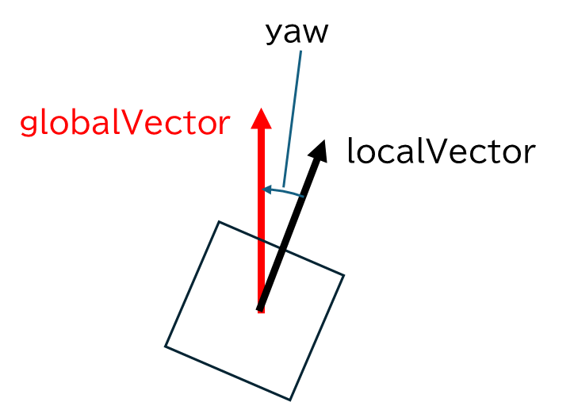

# オムニを動かそう

## モータークラスを使って車輪を動かす

動作確認として単にモーターを動かすだけのプログラムを作成しましょう。

=== "Main.ino"

    ```cpp
    #include "Motor.hpp"

    static Motor motor0{ 19, 17, 18 };    // 右前
    static Motor motor1{ 16, 15, 14 };    // 右後
    static Motor motor2{ 28, 26, 27 };    // 左後
    static Motor motor3{ 22, 20, 21 };    // 左前

    void setup()
    {
        motor0.begin();
        motor1.begin();
        motor2.begin();
        motor3.begin();
    }

    void loop()
    {
        motor0.move(100);
        motor1.move(100);
        motor2.move(100);
        motor3.move(100);
    }
    ```

=== "Motor.hpp"

    ```cpp
    #pragma once

    class Motor
    {
        int pinA;
        int pinB;
        int pinP;

    public:

        Motor(int pinA, int pinB, int pinP)
            : pinA(pinA)
            , pinB(pinB)
            , pinP(pinP)
        {
        }

        void begin()
        {
            pinMode(pinA, OUTPUT);
            pinMode(pinB, OUTPUT);
        }

        void move(int power)
        {
            digitalWrite(pinA, (power >= 0) ? HIGH : LOW);
            digitalWrite(pinB, (power <= 0) ? HIGH : LOW);
            analogWrite(pinP, abs(power));
        }
    };
    ```

## コントローラーからデータを受信

### 🌟 E220 モジュール

920MHz 帯で通信する無線モジュールです。LoRa という変調方式を使っており、長距離通信が可能です。

マイコンとは UART で通信します。


1 対 1 で通信し、通信相手はチャンネルで選択します。920MHz 付近で微妙に周波数を変えることで通信します。

| チャンネル | 周波数 (MHz) |
| :--------: | :----------: |
|     0      |    920.6     |
|     1      |    920.8     |
|     2      |    921.0     |
|     3      |    921.2     |
|     4      |    921.4     |
|     :      |      :       |

### 🌟 デバッグ方法 (値の確認)

シリアルモニターを使って値を PC で見る事ができます。

```cpp
void setup()
{
    Serial.begin(115200);
}

void loop()
{
    int value = 1234;
    Serial.println(value);
    delay(1000);
}
```

!!! note "Serial.println() 関数"

    `Serial.println()` 関数は引数に渡した値をシリアルモニターに表示し、改行します。

    `Serial.print()` 関数は改行しません。

    複数の値を並べて表示する際、タブ文字を挟むと桁が揃い見やすくなります。

    ```cpp
    int a = millis();
    Serial.print(a);
    Serial.print('\t');

    int b = 123;
    Serial.println(b);
    ```

!!! note "シリアルモニターの開き方"
    1. 右上にある「シリアルモニター(虫眼鏡アイコン)」ボタンをクリックします。
    2. ボーレートを 115200 に設定します。

### 🌟 Udon::E220PadPS5 クラス

コントローラーに載っている E220 からデータを受信してみましょう。

コントローラーには [udonrobo/ControllerUnit](https://github.com/udonrobo/ControllerUnit) レポジトリの Firmware/Firmware.ino が書き込まれています。

`Udon::E220PadPS5` クラスは E220 からのデータ受信を行い、ボタンやスティックの状態を取得できるクラスです。

`.serial` には E220 と接続されているシリアルポートを指定し、m0, m1, aux と接続しているピン番号をそれぞれ指定します。

```cpp linenums="1" title="E220PadPS5クラス最小構成"
#include <Udon.hpp>

static Udon::E220PadPS5 pad{{
    .serial  = Serial1,
    .m0      = 13,
    .m1      = 12,
    .aux     = 2,
}};

void setup()
{
    const int channel = 3;
    pad.begin(channel);
}

void loop()
{
    pad.update();
}
```

ボタンの値は `getボタン名()` メンバ関数で取得できます。`getボタン名()` 関数は `Udon::Input` 構造体を返し、次の状態を持ちます。

```cpp
struct Input
{
    bool press;    // 押されているか
    bool click;    // 押された瞬間か
    bool release;  // 離された瞬間か
    bool toggle;   // 押すごとに入れ替わる
};
```

```cpp linenums="1" title="ボタンの値を取得する例"
#include <Udon.hpp>

static Udon::E220PadPS5 pad{{
    .serial  = Serial1,
    .m0      = 13,
    .m1      = 12,
    .aux     = 2,
}};

void setup()
{
    const int channel = 3;
    pad.begin(channel);
    Serial.begin(115200);
}

void loop()
{
    pad.update();

    // バツボタンが押された瞬間
    if (pad.getCross().click)
    {
        Serial.println("Cross button is clicked.");
    }

    // 三角ボタンが押されている間
    if (pad.getTriangle().press)
    {
        Serial.println("Triangle button is pressed.");
    }

    delay(10);
}
```

スティックの値は `getLeftStick()` と `getRightStick()` メンバ関数で取得できます。`Udon::Vec2` 構造体を返します。

```cpp linenums="1" title="スティックの値を取得する例"
#include <Udon.hpp>

static Udon::E220PadPS5 pad{{
    .serial  = Serial1,
    .m0      = 13,
    .m1      = 12,
    .aux     = 2,
}};

void setup()
{
    const int channel = 3;
    pad.begin(channel);
    Serial.begin(115200);
}

void loop()
{
    pad.update();

    Udon::Vec2 left  = pad.getLeftStick();
    Serial.println(left.x);  // 左スティックの x 座標 (-255~255)

    delay(10);
}
```

## オムニの出力値算出

スティックの値から各モーターの出力値を算出しましょう。

左スティックの x, y 軸で平行移動し、右スティックの x 軸で回転させるとします。

```cpp
const double x = pad.getLeftStick().x;
const double y = pad.getLeftStick().y;
const double turn = pad.getRightStick().x;
```

### 🌟 考え方

一度に x, y, turn からモーターの出力値を算出するのは難しいです。

そこで、x から各モーターの出力値を算出、y から各モーターの出力値を算出、turn から各モーターの出力値を算出し、最後に足し合わせることで出力値を算出します。

### 🌟 x 成分を考える

x の正方向へ動くときの各モーターの出力値を考えます。



すると、次のような出力値が算出されます。

```cpp
m0 = +x
m1 = -x
m2 = -x
m3 = +x
```

### 🌟 y 成分を考える

y の正方向へ動くときの各モーターの出力値を考えます。


すると、次のような出力値が算出されます。

```cpp
m0 = -y
m1 = -y
m2 = +y
m3 = +y
```

### 🌟 旋回成分を考える

旋回するときの各モーターの出力値を考えます。


すると、次のような出力値が算出されます。

```cpp
m0 = turn
m1 = turn
m2 = turn
m3 = turn
```

### 🌟 合成

それぞれの出力値を足し合わせることで、最終的な出力値を算出します。

```cpp
m0 = +x - y + turn
m1 = -x - y + turn
m2 = -x + y + turn
m3 = +x + y + turn
```

### 🌟 実装 (途中)

```cpp
void loop()
{
    pad.update();

    const double x = pad.getLeftStick().x;
    const double y = pad.getLeftStick().y;
    const double turn = pad.getRightStick().x;

    double m0 = +x - y + turn;
    double m1 = -x - y + turn;
    double m2 = -x + y + turn;
    double m3 = +x + y + turn;

    motor0.move(m0);
    motor1.move(m1);
    motor2.move(m2);
    motor3.move(m3);

    delay(10);
}
```

### 🌟 出力値の圧縮

現在は x, y, turn の値を足しているだけなので、算出値がモータードライバの動作範囲 (-210 ~ 210) を超えることがあります。

そこで出力値が -210 ~ 210 の範囲に収まるように調整します。

※ ±210 は実験機での動作範囲です。モータードライバによって異なります。

```cpp linenums="1"
const double limitPower = 210;

const double maxPower = std::max({ abs(m0), abs(m1), abs(m2), abs(m3) });

if (maxPower > limitPower)
{
    const double ratio = limitPower / maxPower;
    m0 *= ratio;
    m1 *= ratio;
    m2 *= ratio;
    m3 *= ratio;
}
```

### 🌟 実装 (最終)

```cpp linenums="1" hl_lines="37-47"
#include <Udon.hpp>
#include "Motor.hpp"

static Udon::E220PadPS5 pad{{
    .serial  = Serial1,
    .m0      = 13,
    .m1      = 12,
    .aux     = 2,
}};

static Motor motor0{ 19, 17, 18 };    // 右前
static Motor motor1{ 16, 15, 14 };    // 右後
static Motor motor2{ 28, 26, 27 };    // 左後
static Motor motor3{ 22, 20, 21 };    // 左前

void setup()
{
    const int channel = 3;
    pad.begin(channel);
}

void loop()
{
    pad.update();

    // スティックの値を取得
    const double x = pad.getLeftStick().x;
    const double y = pad.getLeftStick().y;
    const double turn = pad.getRightStick().x;

    // 各モーターの出力値を算出
    double m0 = +x - y + turn;
    double m1 = -x - y + turn;
    double m2 = -x + y + turn;
    double m3 = +x + y + turn;

    // 出力値を圧縮
    const double limitPower = 210;
    const double maxPower = std::max({ abs(m0), abs(m1), abs(m2), abs(m3) });
    if (maxPower > limitPower)
    {
        const double ratio = limitPower / maxPower;
        m0 *= ratio;
        m1 *= ratio;
        m2 *= ratio;
        m3 *= ratio;
    }

    // モーターを動かす
    motor0.move(m0);
    motor1.move(m1);
    motor2.move(m2);
    motor3.move(m3);

    delay(10);
}
```

!!! note "ズル"

    実はオムニの出力値を算出する関数があります。

    ```cpp
    const auto powers = pad.getMoveInfo().toOmni<4>();

    motor0.move(powers[0]);
    motor1.move(powers[1]);
    motor2.move(powers[2]);
    motor3.move(powers[3]);
    ```

## 旋回角補正

現在の実装ではモーターの個体差によって平行移動中であっても徐々に旋回してしまいます。

そこで、旋回角を計測し、平行移動中は旋回角が 0 になるように補正します。


### 🌟 旋回角をジャイロセンサから取得する

ジャイロセンサ (BNO055) から旋回角を取得します。

```cpp
#include <Udon.hpp>

static Udon::BNO055 gyro{ Wire };

void setup()
{
    Serial.begin(115200);

    gyro.begin();
}

void loop()
{
    gyro.update();

    const double angle = gyro.getYaw();

    Serial.println(angle);

    delay(10);
}
```

### 🌟 旋回移動はしないと仮定して補正

取得した旋回角を使って、平行移動中は旋回角が 0 になるように補正します。

現在の値と目標の値を比較し補正値を算出するという制御は、フィードバック制御と呼ばれます。中でも PID 制御という制御方法は調整が容易なため部で使用しています。

フィードバック制御は次のように行います。P は比例、I は積分、D は微分です。

```cpp linenums="1"
#include <Udon.hpp>

static Udon::LoopCycleController loopCtrl{ 10000 };
static Udon::PidController pid{ 150, 0, 50, loopCtrl.cycleUs() };
//                                ^P ^I  ^D

void setup()
{
}

void loop()
{
    double 補正値 = pid(現在の値, 目標の値);
    loopCtrl.update();
}
```

旋回角を 0 度に補正する場合は次のようになります。

```cpp linenums="1" hl_lines="16-20 26 32 39-52 72"
#include <Udon.hpp>
#include "Motor.hpp"

static Udon::E220PadPS5 pad{{
    .serial  = Serial1,
    .m0      = 13,
    .m1      = 12,
    .aux     = 2,
}};

static Motor motor0{ 19, 17, 18 };    // 右前
static Motor motor1{ 16, 15, 14 };    // 右後
static Motor motor2{ 28, 26, 27 };    // 左後
static Motor motor3{ 22, 20, 21 };    // 左前

static Udon::BNO055 gyro{ Wire };

static Udon::LoopCycleController loopCtrl{ 10000 };

static Udon::PidController turnPid{ 150, 0, 50, loopCtrl.cycleUs() };

void setup()
{
    const int channel = 3;
    pad.begin(channel);
    gyro.begin();
}

void loop()
{
    pad.update();
    gyro.update();

    // スティックの値を取得
    const double x = pad.getLeftStick().x;
    const double y = pad.getLeftStick().y;
    const double turn = pad.getRightStick().x;

    // ジャイロセンサから旋回角を取得
    const double yaw = gyro.getYaw();

    // 目標の旋回角を 0 に設定
    const double targetYaw = 0;

    // PID 制御で補正値を算出
    const double correctionTurn = turnPid(yaw, targetYaw);

    // 各モーターの出力値を算出
    double m0 = +x - y + turn - correctionTurn;
    double m1 = -x - y + turn - correctionTurn;
    double m2 = -x + y + turn - correctionTurn;
    double m3 = +x + y + turn - correctionTurn;

    // 出力値を圧縮
    const double limitPower = 210;
    const double maxPower = std::max({ abs(m0), abs(m1), abs(m2), abs(m3) });
    if (maxPower > limitPower)
    {
        const double ratio = limitPower / maxPower;
        m0 *= ratio;
        m1 *= ratio;
        m2 *= ratio;
        m3 *= ratio;
    }

    // モーターを動かす
    motor0.move(m0);
    motor1.move(m1);
    motor2.move(m2);
    motor3.move(m3);

    loopCtrl.update();
}
```

### 🌟 旋回移動できるように補正

旋回移動を考慮して旋回角を補正します。旋回中は旋回補正を無効にします。

現在は目標角度を 0 にしていますが、旋回中は目標角度を現在の旋回角度にすることで旋回補正を無効にします。

```cpp linenums="1" hl_lines="30 45-53"
#include <Udon.hpp>
#include "Motor.hpp"

static Udon::E220PadPS5 pad{{
    .serial  = Serial1,
    .m0      = 13,
    .m1      = 12,
    .aux     = 2,
}};

static Motor motor0{ 19, 17, 18 };    // 右前
static Motor motor1{ 16, 15, 14 };    // 右後
static Motor motor2{ 28, 26, 27 };    // 左後
static Motor motor3{ 22, 20, 21 };    // 左前

static Udon::BNO055 gyro{ Wire };

static Udon::LoopCycleController loopCtrl{ 10000 };

static Udon::PidController turnPid{ 150, 0, 50, loopCtrl.cycleUs() };

void setup()
{
    const int channel = 3;
    pad.begin(channel);
    gyro.begin();
}

// 目標の旋回角
double targetYaw;

void loop()
{
    pad.update();
    gyro.update();

    // スティックの値を取得
    const double x = pad.getLeftStick().x;
    const double y = pad.getLeftStick().y;
    const double turn = pad.getRightStick().x;

    // ジャイロセンサから旋回角を取得
    const double yaw = gyro.getYaw();

    if (turn)
    {
        // 旋回中は旋回補正を無効にする
        targetYaw = yaw;
    }
    else
    {
        // targetYaw はグローバル変数なので、旋回後は旋回終了時の角度が維持され、補正される
    }

    // PID 制御で補正値を算出
    const double correctionTurn = turnPid(yaw, targetYaw);

    // 各モーターの出力値を算出
    double m0 = +x - y + turn - correctionTurn;
    double m1 = -x - y + turn - correctionTurn;
    double m2 = -x + y + turn - correctionTurn;
    double m3 = +x + y + turn - correctionTurn;

    // 出力値を圧縮
    const double limitPower = 210;
    const double maxPower = std::max({ abs(m0), abs(m1), abs(m2), abs(m3) });
    if (maxPower > limitPower)
    {
        const double ratio = limitPower / maxPower;
        m0 *= ratio;
        m1 *= ratio;
        m2 *= ratio;
        m3 *= ratio;
    }

    // モーターを動かす
    motor0.move(m0);
    motor1.move(m1);
    motor2.move(m2);
    motor3.move(m3);

    loopCtrl.update();
}
```

### 🌟 旋回後の慣性を考慮し補正

前回の実装では旋回終了後、すぐに旋回角の補正を有効にしました。しかし、実際は旋回終了後、慣性によって少しの間旋回します。そこで、旋回終了後に少し待ってから補正を有効にします。

具体的には、旋回終了時刻を記録し、その時刻から一定時間経過後に補正を有効にします。

```cpp linenums="1" hl_lines="33 48-60"
#include <Udon.hpp>
#include "Motor.hpp"

static Udon::E220PadPS5 pad{{
    .serial  = Serial1,
    .m0      = 13,
    .m1      = 12,
    .aux     = 2,
}};

static Motor motor0{ 19, 17, 18 };    // 右前
static Motor motor1{ 16, 15, 14 };    // 右後
static Motor motor2{ 28, 26, 27 };    // 左後
static Motor motor3{ 22, 20, 21 };    // 左前

static Udon::BNO055 gyro{ Wire };

static Udon::LoopCycleController loopCtrl{ 10000 };

static Udon::PidController turnPid{ 150, 0, 50, loopCtrl.cycleUs() };

void setup()
{
    const int channel = 3;
    pad.begin(channel);
    gyro.begin();
}

// 目標の旋回角
double targetYaw;

// 旋回終了時刻
uint32_t lastTurnMs;

void loop()
{
    pad.update();
    gyro.update();

    // スティックの値を取得
    const double x = pad.getLeftStick().x;
    const double y = pad.getLeftStick().y;
    const double turn = pad.getRightStick().x;

    // ジャイロセンサから旋回角を取得
    const double yaw = gyro.getYaw();

    if (turn)
    {
        // 旋回中は時刻を記録し続ける
        lastTurnMs = millis();
    }

    // 現在の時刻と差をとると、旋回後何ms経過したかを求められる
    const uint32_t elapsedMs = millis() - lastTurnMs;
    if (elapsedMs < 1000)
    {
        // 旋回終了後 1 秒以内は補正を無効にする。旋回中もこの if に入るため、無効になる
        targetYaw = yaw;
    }

    // PID 制御で補正値を算出
    const double correctionTurn = turnPid(yaw, targetYaw);

    // 各モーターの出力値を算出
    double m0 = +x - y + turn - correctionTurn;
    double m1 = -x - y + turn - correctionTurn;
    double m2 = -x + y + turn - correctionTurn;
    double m3 = +x + y + turn - correctionTurn;

    // 出力値を圧縮
    const double limitPower = 210;
    const double maxPower = std::max({ abs(m0), abs(m1), abs(m2), abs(m3) });
    if (maxPower > limitPower)
    {
        const double ratio = limitPower / maxPower;
        m0 *= ratio;
        m1 *= ratio;
        m2 *= ratio;
        m3 *= ratio;
    }

    // モーターを動かす
    motor0.move(m0);
    motor1.move(m1);
    motor2.move(m2);
    motor3.move(m3);

    loopCtrl.update();
}
```

## ポジティブ制御

現在の実装はロボットから見た座標系で動作します。しかしこれは操縦者にとっては直感的ではない場合があります。

そこで、下の図のように操縦者から見た座標系で動作するようにします。


回転行列を使い、ロボットから見た座標系の値を操縦者から見た座標系の値に変換します。

例えば下の図では y = 200 を入力し、localVector に { 0, 200 } が入っているとしています。このベクトルを旋回角分回転させると、globalVector は操縦者から見た直進方向のベクトルになります。



```cpp linenums="1" hl_lines="46-50 52-57 77-80"
#include <Udon.hpp>
#include "Motor.hpp"

static Udon::E220PadPS5 pad{{
    .serial  = Serial1,
    .m0      = 13,
    .m1      = 12,
    .aux     = 2,
}};

static Motor motor0{ 19, 17, 18 };    // 右前
static Motor motor1{ 16, 15, 14 };    // 右後
static Motor motor2{ 28, 26, 27 };    // 左後
static Motor motor3{ 22, 20, 21 };    // 左前

static Udon::BNO055 gyro{ Wire };

static Udon::LoopCycleController loopCtrl{ 10000 };

static Udon::PidController turnPid{ 150, 0, 50, loopCtrl.cycleUs() };

void setup()
{
    const int channel = 3;
    pad.begin(channel);
    gyro.begin();
}

// 目標の旋回角
double targetYaw;

// 旋回終了時刻
uint32_t lastTurnMs;

void loop()
{
    pad.update();
    gyro.update();

    // ジャイロセンサから旋回角を取得
    const double yaw = gyro.getYaw();

    // スティックの値を取得
    const double turn = pad.getRightStick().x;

    // ロボットから見た座標系
    const Udon::Vec2 localVector = pad.getLeftStick();

    // 操縦者から見た座標系に変換
    const Udon::Vec2 globalVector = localVector.rotated(yaw);

    // タッチパッドのクリックでポジティブ制御のゼロ角度を設定
    if (pad.getTouch().click)
    {
        gyro.clear();
        targetYaw = 0;
    }

    if (turn)
    {
        // 旋回中は時刻を記録し続ける
        lastTurnMs = millis();
    }

    // 現在の時刻と差をとると、旋回後何ms経過したかを求められる
    const uint32_t elapsedMs = millis() - lastTurnMs;
    if (elapsedMs < 1000)
    {
        // 旋回終了後 1 秒以内は補正を無効にする。旋回中もこの if に入るため、無効になる
        targetYaw = yaw;
    }

    // PID 制御で補正値を算出
    const double correctionTurn = turnPid(yaw, targetYaw);

    // 各モーターの出力値を算出
    double m0 = +globalVector.x - globalVector.y + turn - correctionTurn;
    double m1 = -globalVector.x - globalVector.y + turn - correctionTurn;
    double m2 = -globalVector.x + globalVector.y + turn - correctionTurn;
    double m3 = +globalVector.x + globalVector.y + turn - correctionTurn;

    // 出力値を圧縮
    const double limitPower = 210;
    const double maxPower = std::max({ abs(m0), abs(m1), abs(m2), abs(m3) });
    if (maxPower > limitPower)
    {
        const double ratio = limitPower / maxPower;
        m0 *= ratio;
        m1 *= ratio;
        m2 *= ratio;
        m3 *= ratio;
    }

    // モーターを動かす
    motor0.move(m0);
    motor1.move(m1);
    motor2.move(m2);
    motor3.move(m3);

    loopCtrl.update();
}
```

## 遠隔非常停止の実装

ロボコンでは安全上、コントローラーからロボットを停止させられる必要があります。

部ではバツボタンによって非常停止、動作を切り替えます。toggle は初期値が false なので、次のようにすると非常停止がかかった状態で起動します。

```cpp
if (pad.getCross().toggle)
{
    // 動作可能
}
else
{
    // 非常停止 (起動時は false なので、ここに入る)
}
```

またコントローラーが何らかの原因で切断された場合、ロボットも停止するようにします。

```cpp
if (pad)
{
    // 動作可能
}
else
{
    // 非常停止
}
```

組み合わせると下のようになります。

```cpp
if (pad && pad.getCross().toggle)
{
    // 動作可能
}
else
{
    // 非常停止
}
```

短く書けるように、`pad.isOperable()` という関数があります。処理内容は上のコードと同じです。

```cpp
if (pad.isOperable())
{
    // 動作可能
}
else
{
    // 非常停止
}
```

## 🌟 完成形


```cpp linenums="1" hl_lines="40"
#include <Udon.hpp>
#include "Motor.hpp"

static Udon::E220PadPS5 pad{{
    .serial  = Serial1,
    .m0      = 13,
    .m1      = 12,
    .aux     = 2,
}};

static Motor motor0{ 19, 17, 18 };    // 右前
static Motor motor1{ 16, 15, 14 };    // 右後
static Motor motor2{ 28, 26, 27 };    // 左後
static Motor motor3{ 22, 20, 21 };    // 左前

static Udon::BNO055 gyro{ Wire };

static Udon::LoopCycleController loopCtrl{ 10000 };

static Udon::PidController turnPid{ 150, 0, 50, loopCtrl.cycleUs() };

void setup()
{
    const int channel = 3;
    pad.begin(channel);
    gyro.begin();
}

// 目標の旋回角
double targetYaw;

// 旋回終了時刻
uint32_t lastTurnMs;

void loop()
{
    pad.update();
    gyro.update();

    if (pad.isOperable())
    {
        // ジャイロセンサから旋回角を取得
        const double yaw = gyro.getYaw();

        // スティックの値を取得
        const double turn = pad.getRightStick().x;

        // ロボットから見た座標系
        const Udon::Vec2 localVector = pad.getLeftStick();

        // 操縦者から見た座標系に変換
        const Udon::Vec2 globalVector = localVector.rotated(yaw);

        // タッチパッドのクリックでポジティブ制御のゼロ角度を設定
        if (pad.getTouch().click)
        {
            gyro.clear();
            targetYaw = 0;
        }

        if (turn)
        {
            // 旋回中は時刻を記録し続ける
            lastTurnMs = millis();
        }

        // 現在の時刻と差をとると、旋回後何ms経過したかを求められる
        const uint32_t elapsedMs = millis() - lastTurnMs;
        if (elapsedMs < 1000)
        {
            // 旋回終了後 1 秒以内は補正を無効にする。旋回中もこの if に入るため、無効になる
            targetYaw = yaw;
        }

        // PID 制御で補正値を算出
        const double correctionTurn = turnPid(yaw, targetYaw);

        // 各モーターの出力値を算出
        double m0 = +globalVector.x - globalVector.y + turn - correctionTurn;
        double m1 = -globalVector.x - globalVector.y + turn - correctionTurn;
        double m2 = -globalVector.x + globalVector.y + turn - correctionTurn;
        double m3 = +globalVector.x + globalVector.y + turn - correctionTurn;

        // 出力値を圧縮
        const double limitPower = 210;
        const double maxPower = std::max({ abs(m0), abs(m1), abs(m2), abs(m3) });
        if (maxPower > limitPower)
        {
            const double ratio = limitPower / maxPower;
            m0 *= ratio;
            m1 *= ratio;
            m2 *= ratio;
            m3 *= ratio;
        }

        // モーターを動かす
        motor0.move(m0);
        motor1.move(m1);
        motor2.move(m2);
        motor3.move(m3);
    }
    else
    {
        // 非常停止
        motor0.stop();
        motor1.stop();
        motor2.stop();
        motor3.stop();
    }

    loopCtrl.update();
}
```
